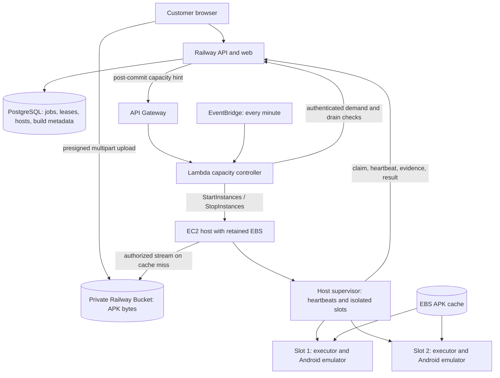

# Plan: Elastic Android device hosts and large APK delivery

## Summary

Deliver an operated Android device pool that can start an EC2 host for queued work,
reuse locally cached APKs, run as many isolated emulator slots as the host has been
qualified to support, and stop the host after a safe idle drain. Raise the APK limit
to **2 GiB inclusive (2,147,483,648 bytes)** with bounded, resumable transfers and
bounded validation. Keep the initial API, database and private object storage on
Railway, with Doppler providing runtime secrets.

Local implementation is recorded in the
[implementation report](../reports/elastic-android-device-farm-and-large-apks-report.md)
and [canonical spec 11](../../../docs/architect/implementation/11-elastic-device-hosts-and-large-apks.md).
This plan remains active until its external qualification and hosted pilot gates
are satisfied; it is not evidence of deployed infrastructure or measured density.
Implement the phases below as separate coherent increments; do not try to deploy
this entire XL change in one release.

## User Story

As an operator onboarding mobile QA customers, I want device compute to follow
actual test demand and reuse large application builds, so that I can offer reliable
tests without paying for idle emulator hosts all day.

As a tester, I want a large build to upload reliably and my run to show whether it
is waiting for a device, preparing Android, installing the app or executing tests.

## Problem → Solution

Current local workers own one emulator lifecycle, claim through the API, and rely on
an already-running process. Uploads are capped at 250 MiB, and build downloads have
whole-file buffering paths. There is no production host controller or warm pool.

Introduce durable host/slot state, a runtime capacity controller, explicit device
ownership, resumable object-storage transfers and a host disk cache. Preserve the
existing database queue, lease fencing, cleanup rules, model qualification and
monthly-credit accounting.

## Metadata

- **Complexity:** XL; four implementation phases plus a deployment/qualification gate.
- **Source PRD:** N/A — standalone consolidation of the deployment conversation.
- **PRD Phase:** N/A.
- **Estimated Files:** 60–80 including new modules, tests and generated contracts.
- **Tasks:** 18, ordered by dependencies below.
- **Research date:** 2026-09-22.
- **Source baseline:** `bdcba79e736bcecf5a3adaac58a8ee813bf01300` with research notes about local files that were subsequently removed by request.
- **Confidence:** 7/10 for phased implementation; cloud performance and provider
  integration require real qualification before a production claim.
- **Authorization:** local implementation and validation authorized by the subsequent
  `prp-implement` request. Applying infrastructure, building a paid
  AMI, deploying services or changing hosted credentials requires separate explicit
  authorization. This plan does not provision anything.

## UX Design

### Before

```text
Select APK → upload through API → validate → select build → submit run
                                                     ↓
                                    wait for an already-running worker
```

### After

```text
Select APK (≤ 2 GiB) → resumable upload with progress → validation → ready build
                                                                        ↓
Submit run → queued → starting device host, if needed → preparing device
           → retrieving build, if cache miss → installing → running → report

Operator: pool enabled / schedule / slot limit / idle timeout / drain / recovery
System:   no demand → idle grace → block claims → verify cleanup → stop EC2
```

### Interaction Changes

| Touchpoint        | Before                             | After                                                                      | Notes                                                                          |
| ----------------- | ---------------------------------- | -------------------------------------------------------------------------- | ------------------------------------------------------------------------------ |
| APK upload        | 250 MiB ceiling; one transfer      | 2 GiB; part progress, retry and explicit resume                            | Show byte limit consistently; failed validation is distinct from failed upload |
| Run waiting       | Worker readiness explanations      | Starting host, waiting for slot, incompatible profile, draining/recovering | Show states from API; never promise an unmeasured start time                   |
| Heavy application | Single default resource assumption | Operator assigns a qualified resource/profile class                        | File size alone does not determine runtime memory                              |
| Capacity          | Local manually running worker      | Operator-managed pool with bounded slots                                   | Customer parallel limit and physical capacity are separate controls            |
| Completion        | Worker cleanup                     | Cleanup, slot reset, idle grace and eventual EC2 stop                      | Results can be ready before host power-off                                     |
| Commercial terms  | Monthly credits                    | Same terms; explicit measured occupancy and overhead rules                 | Do not replace billing with Minitap-style parallel-device pricing              |

## Accepted Design and Proposed Defaults

### Ownership and deployment layout



OpenTofu declares the network, instance, encrypted disk, IAM, Lambda, gateway and
schedule. Packer prepares the reusable host image. The capacity Lambda controls
power during normal operation. `tofu apply` is a deployment action, not something
to run for every job; `tofu destroy` is never the idle shutdown mechanism.

Keep one fixed EBS-backed EC2 host for the first pilot. A stopped host retains its
disk cache but loses running processes and RAM. The OS and enabled systemd services
start again on the next boot. API/web, PostgreSQL and object storage remain available
while device compute is stopped. Kubernetes, Redis and SQS are unnecessary for this
first capacity loop: PostgreSQL already owns the durable execution queue.

### Initial policy values

These are explicit starting policies to implement, not measured service guarantees.

| Setting                              | Initial value                                                | Rationale / release condition                                           |
| ------------------------------------ | ------------------------------------------------------------ | ----------------------------------------------------------------------- |
| APK ceiling                          | 2 GiB inclusive                                              | User-selected requirement; enforce before and after transfer            |
| Multipart part size / parallel parts | 16 MiB / 2                                                   | Bounded browser memory; 128 parts for a 2 GiB file                      |
| Upload session / individual URL      | 2 hours / 10 minutes                                         | Renew URL after reauthorization; abort expired sessions                 |
| Validation processing deadline       | 20 minutes                                                   | Separate from transfer/session expiry; heartbeat validation lease       |
| Worker build transfer                | 30 minutes total; 60 seconds without progress                | Heartbeat execution lease throughout; cancellable and retry-bounded     |
| Host reconciliation                  | Every minute plus immediate wake hint                        | Hint improves latency; durable demand is authoritative                  |
| Host startup deadline                | 15 minutes                                                   | Exceeding it quarantines capacity and alerts; no restart loop           |
| Idle grace                           | 15 minutes from last demand/active work                      | Adjustable after measuring arrival patterns                             |
| Warm emulator target                 | 0 initially; 1 during configured windows after qualification | Warm emulator requires qualified ownership/reset path                   |
| Schedule                             | Disabled initially; explicit IANA timezone when enabled      | Out-of-window demand still wakes on-demand unless pool is paused        |
| Standard candidate                   | 2 vCPU / 8 GiB, one slot                                     | Capacity hypothesis, not a maximum or performance guarantee             |
| Larger candidate                     | 4 vCPU / 16 GiB, two standard slots or one heavy slot        | Must pass simultaneous-load qualification                               |
| Heavy profile candidate              | 3–4 vCPU and about 6 GiB guest RAM                           | Host overhead must fit; benchmark with representative customer app      |
| EBS                                  | One encrypted 100 GiB root volume; cache cap 50 GiB          | Retain on stop; allow headroom for OS, SDK, AVDs, installs and evidence |
| Initial pool maximum                 | One EC2 host                                                 | Raise deliberately after cost, isolation and controller qualification   |

Pin the actual instance type, region and AMI at deployment. Select an x86_64 SKU
with AWS-supported nested virtualization; the account/region and current price are
deployment inputs. Enabling nested virtualization and seeing `/dev/kvm` are necessary
but insufficient: run the full Android qualification campaign. Do not assume an
arbitrary 2 vCPU instance can provide KVM.

### APK bytes, database and cache

1. **Object storage:** authoritative private APK bytes, referenced by immutable build.
2. **PostgreSQL:** owner, app, object reference, byte size, server-computed SHA-256,
   validation state and upload/part metadata. Do not store the APK as a database blob.
3. **Host EBS:** bounded local cache, keyed by organization/app and SHA-256. A file
   becomes reusable only after size and digest verification and atomic rename.
4. **Android guest:** installed application and temporary test data. Discard this
   state at the defined reset boundary; do not share customer-installed snapshots.

Twenty independent cases using the same build on the same host can produce one
object-storage download and twenty local installs while that cache entry survives.
A different host, eviction or disk replacement requires another download. Shared-state
sequence work, if integrated, installs once per work unit rather than once per step.
An S3-compatible download is still network traffic; cached installs use local bytes.
API/model calls and the application's own backend traffic still use the network.

At 2 GiB, database `INTEGER` is one byte too small for the inclusive ceiling. Change
`task_sessions.build_bytes` to `BIGINT`, remove narrowing `as i32` casts, and reconcile
all schemas. Existing Rust `u32` can represent this size; it is not itself the
overflow. Prefer validated `i64` size fields with a JSON integer maximum of 2 GiB
across new transport shapes. Ensure generated TypeScript remains `number` and
generated validators accept exactly 2 GiB, rather than inferring an `int32` cap.

Multipart completion does not make a build runnable. The API streams the completed
object into bounded validation scratch, computes the complete SHA-256 itself, runs
existing APK validation, then commits immutable build metadata. Part ETags and
multipart checksum values must not be substituted for the full-file SHA-256.
Make validation restartable with a database job/lease and idempotent finalization;
do not rely on a fire-and-forget task in an API process.

Do not equate the 2 GiB compressed input ceiling with arbitrary decompression.
Retain bounded entry count, names, ZIP ratios and scratch limits; introduce a separate
documented total uncompressed limit of 8 GiB and per-entry limit of 4 GiB minus one byte for the
large-build validator, subject to reserved free disk and a finite deadline. Reject
larger expanded applications clearly. These bounds are operator policy and require
hosted scratch sizing and representative APK acceptance before launch. Preserve the
existing rejection of ZIP64/multidisk APKs. The current validator streams decompressed
entries to check CRC; it does not extract the whole archive to disk. Preserve that
bounded approach and budget disk separately for the APK and external validation tools.

### Authentication and registration

- The API owns operator-configured pools, allowed instance IDs and app/profile
  bindings. Browser users cannot register arbitrary hosts or request arbitrary EC2 IDs.
- Provision a per-host random credential through a narrowly scoped Doppler config.
  Store only its hash in the API. Bind it to a registered pool/instance record;
  possession permits host protocol operations, not unrestricted app build access.
- On every boot, the host reports its configured identity, Linux boot ID, toolchain
  digest, capabilities and qualification record. API creates a new boot generation
  and fences earlier slot sessions. Capabilities are advertisements, not proof of
  qualification; API checks operator-approved records and app/profile bindings.
- Model identity remains separate: retain protocol-6 exact model qualification.
  Define host protocol version 1; allocate an execution protocol revision at
  integration without overwriting existing versions or unrelated sequence changes.
- Each slot obtains an app/profile-bound execution credential or grant after the API
  authorizes its binding. Existing worker identity and lease checks still gate build,
  evidence and result endpoints. Scope grants to host generation and lease where
  applicable. A tenant-neutral host token alone cannot download customer builds.
- Railway sends a timestamped HMAC-SHA256 wake request through API Gateway: canonical
  method/path/body hash, timestamp and unique request ID; reject expired/replayed
  requests using durable controller-operation records. Use a dedicated secret and
  constant-time verification. The request is a hint containing pool/request IDs.
- Lambda authenticates to the control API with a separate scoped credential and
  re-reads durable demand before acting. Do not reuse browser sessions or host tokens.
- Keep Doppler as runtime secret authority. Platform secret stores hold only the
  narrowly scoped bootstrap token. Host/API processes run under
  `doppler run --no-fallback --forward-signals`; Lambda container bootstrap retrieves
  its bootstrap token in memory and launches its runtime under the same wrapper.
  Do not write credentials, Doppler fallback files or `.env` files into images/disks.
- Pin credential rotation/revocation behavior: rotate host grants without interrupting
  already accepted result receipts; revoked credentials prevent new claims. Never
  log signed URLs, authorization headers, APK contents or Doppler token values.

### Emulator identity and concurrency

Separate **pool policy → physical host/boot → slot → emulator boot**. A logical
execution profile describes Android API level, ABI, resources and qualification;
it is not an EC2 instance ID or an ADB serial. A slot has stable identity within a
host, isolated AVD/userdata directory, assigned emulator console/ADB ports, isolated
ADB server port/environment, process containment and a fresh emulator boot nonce.

The checked-in SDK lock pins emulator 37.1.11, API 35 Google APIs x86_64 revision 9,
platform tools 37.0.1, command-line tools 19.0 and build tools 35.0.0. The API APK
validator has its own tool requirements; do not accidentally align independent
validation pins by deleting them. Bake qualified packages into the AMI; a job selects
an approved immutable profile and image digest. Never run SDK updates during a job.

The host supervisor owns emulator processes for their entire lifetime. Executors
use a private local Unix-socket device interface scoped to a slot/lease; they do not
attach to arbitrary existing serials. The supervisor owns wipe/reset, boot, install,
command authorization, deadline handling, evidence handoff and cleanup receipts.
Initially it may start a fresh emulator for each assignment. Warm mode boots a
pristine emulator ahead of assignment using the same ownership path. Return a slot
to availability only after verified reset or destroy/recreate. Stop warm processes
before reporting a drained host.

Existing code deliberately rejects unknown emulator processes. Preserve this safety
property while introducing supervisor ownership. Preserve the standalone qualification
and demo adapters; production slot configuration replaces their fixed `emulator-5554`
assumption without globally rewriting fixtures. Never run a shared `adb kill-server`
as a slot cleanup action.

Effective concurrency is bounded by qualified slots, host resource headroom,
customer parallel limits, available model capacity and app/test-account isolation.
The existing app-wide reservation remains: two physical slots can run independent
apps, but do not promise two simultaneous runs for one app without a separately
qualified backend/account isolation model. A worker process is inexpensive relative
to Android; starting ten Python workers does not create ten safe emulator slots.

KVM allows the emulator guest CPU to use hardware virtualization. On EC2 this is
nested virtualization: Android is a guest inside the EC2 guest. It does not supply
a GPU or make RAM/CPU contention disappear. Heavy graphics with software rendering
can reduce capacity substantially. Reject incompatible native-library ABIs early;
do not promise ARM-only APKs will work on an x86_64 image.

### Start, run, drain and stop

```text
EC2 stopped
  → job commits in PostgreSQL
  → durable wake outbox + immediate capacity hint (minute reconciliation is fallback)
  → Lambda sees eligible demand, calls StartInstances once
  → EC2 pending/running; systemd starts supervisor automatically
  → supervisor registers new boot, verifies recovery and qualified slots
  → API permits slot claims; cache → install → execute → evidence/result → cleanup
  → no demand for 15 minutes and no scheduled warm requirement
  → API fences host as draining; all claim paths stop admitting work
  → supervisor stops warm devices and reports verified clean state
  → controller commits a fenced stop operation and calls StopInstances
  → EC2 stopping/stopped; EBS remains
```

Suggested host states: `stopped`, `starting`, `ready`, `draining`, `stop_committed`,
`stopping`, `quarantined`. Store observed AWS power separately from application
readiness. Suggested slot states: `offline`, `preparing`, `idle`, `leased`,
`cleaning`, `quarantined`. State changes carry host boot generation and monotonic
control-operation version; stale reports cannot revive old slots.

**Stop-race rules are required implementation, not optional hardening:**

1. All execution and interactive-phone claim paths check the same host fence inside
   their claim transaction. Lock candidate app, then host, then slot consistently;
   retain existing app/device reservations and SKIP LOCKED queue selection.
2. Draining blocks new claims. Count downloads, installs, evidence uploads, result
   finalization, recovery and interactive sessions as active work, not only test steps.
3. Fresh host heartbeat and a cleanup receipt must prove owned process groups are
   dead, ports released and journals resolved. Missing heartbeat is not a clean drain.
4. API returns a short-lived drain token bound to host/boot/control generation. The
   controller must atomically commit it as `stop_committed` after a final demand and
   lease check. Demand arriving before this commit cancels drain; demand afterwards
   stays queued for the next boot and cannot re-enable the fenced host.
5. Run the initial controller with reserved concurrency **1**. It is the sole normal
   Start/Stop caller. Persist operation intents and reconcile uncertain AWS outcomes
   before another power action. Never start a new boot while a prior stop operation
   could still execute. API fencing alone cannot condition an AWS StopInstances call
   on an EC2 boot generation; serialization and observed completion close that gap.
6. Lambda performs one bounded reconciliation pass; it does not wait for Android or
   sleep until idle. Duplicate hints/schedules are safe. Demand during `stopping`
   waits for `stopped`, then triggers start. If API is unavailable, do not stop.
7. Quarantine and retain reservations when cleanup is uncertain. Alert with an
   operator procedure to fence and power-stop an unhealthy host if needed to bound
   spend; this does not mark attempts clean or delete recovery evidence. A successful
   operator stop still requires recovery/qualification before new claims.

Use IAM Start/Stop permissions scoped to configured instances. Separate Describe
permissions where AWS requires broader resource scope. No inbound public ADB or SSH
is required. Use SSM for explicitly authorized operations and outbound HTTPS for
workers. Account for the selected subnet's actual egress costs; do not introduce a
NAT Gateway as an unnoticed always-on pilot expense.

For the initial single host, use a public subnet with a public IPv4 address and no
inbound security-group rules; include IPv4 charges in the estimate. The host initiates
outbound HTTPS and SSM connections. Restrict emulator guest traffic from reaching
EC2 metadata, host management services and private infrastructure address ranges;
IMDSv2 alone is not guest isolation. Test those boundaries before multi-tenant use.
Private customer backends require a separately authorized network design.

### Cost and sizing model

```text
Daily device cost = running EC2 hours × current regional hourly price
                 + provisioned EBS daily cost
                 + applicable IP/network/controller/logging charges

Whole-service cost adds Railway API + database + object storage + model usage.
```

The earlier $0.096–$0.101/hour discussion was a compute estimate, not a deployed
quote. At an illustrative $0.10/hour, eight running hours cost $0.80 and 24 hours
cost $2.40 for compute alone. A schedule reduces cost only if it actually stops
compute; an idle warm emulator keeps the host billable. Stopped EBS and other retained
resources still cost money. Measure billed host minutes, useful occupied slot minutes,
warm idle time, boot time, cache hit rate and cost per accepted run.

Compressed x86 SDK archives in the lock total approximately 3.23 GiB; this is not
the installed footprint. Budget additional OS/runtime/SDK extraction, AVD writable
images, installed app expansion, APK cache, validation scratch and evidence. Admit
work only after a disk-space reservation, leaving at least 15 GiB host safety reserve;
evict only unpinned complete cache entries. A 2 GiB file can need far more guest disk
and memory after installation. Do not derive maximum emulator count from RAM division
alone. Benchmark one then two slots under representative CPU, graphics, I/O and model
latency, with clean reset and cancellation included.

Public Minitap sources demonstrate agents connecting to Android devices and commercial
parallel capacity. They do not establish a per-EC2 emulator density or internal fleet
cost. Use the public sources below as comparison context, not proof of our sizing.
Azure remains a future provider evaluation; do not invent a parallel Azure deployment
or pricing quote in this AWS implementation. Compare its qualified nested-virtualization
SKUs and total costs if the AWS pilot fails measured cost/performance targets.

## Mandatory Reading

Line references are research anchors at the recorded baseline; read complete functions
around each anchor. Generated outputs are inspected through the generator, not edited.

| Priority | File                                                                                      | Lines / section                      | Why                                                                        |
| -------- | ----------------------------------------------------------------------------------------- | ------------------------------------ | -------------------------------------------------------------------------- |
| P0       | `docs/architect/README.md`                                                                | all                                  | Authority and documentation rules                                          |
| P0       | `docs/architect/hosting.md`, `environment.md`, `contracts.md`                             | all                                  | Hosting, Doppler, generated transport                                      |
| P0       | `docs/architect/implementation/02-cloud-phone-and-feasibility.md`                         | all                                  | Qualification and lifecycle acceptance                                     |
| P0       | `docs/architect/implementation/04-execution-and-reports.md`                               | all                                  | Leases, reports, cleanup fences                                            |
| P0       | `docs/architect/implementation/09-model-catalog-and-capacity.md`                          | all                                  | Model compatibility and queue admission                                    |
| P0       | `apps/api/src/config.rs`                                                                  | 24–45 and Setup construction         | Size limits, semaphore budgets, toolchain config                           |
| P0       | `apps/api/src/services/uploads.rs`                                                        | 71–305 and complete/validation path  | Existing upload leases, digest, completion                                 |
| P0       | `apps/api/src/storage/mod.rs`                                                             | 25–66, 122–185                       | Local/S3 adapters and stream materialization                               |
| P0       | `apps/api/src/services/scheduler.rs`                                                      | 113–275 plus heartbeat/release       | Actual claim transaction and device fencing                                |
| P0       | `apps/api/src/services/task_sessions.rs`                                                  | 184–251, around 485                  | Interactive phone shares devices; narrowing size casts                     |
| P0       | `apps/api/src/controllers/worker.rs`, `apps/api/src/controllers/task_sessions.rs`         | build/download handlers              | Whole-file response buffers and authorization                              |
| P0       | `apps/api/src/controllers/setup.rs`, `apps/api/src/services/apk_validation.rs`            | upload routes; archive validation    | HTTP body limit, CRC/expansion/ABI checks and external validator deadlines |
| P0       | `apps/mobile-worker/src/mobile_qa_worker/execution/client.py`                             | raw/download methods                 | Full-body reads; 5-second default timeout                                  |
| P0       | `apps/mobile-worker/src/mobile_qa_worker/execution/runner.py`                             | around 170, 341 onwards              | Download before heartbeat, serve loop and journals                         |
| P0       | `apps/mobile-worker/src/mobile_qa_worker/execution/lifecycle.py`                          | 41–88 and cleanup                    | Owned boot/install boundary                                                |
| P0       | `apps/mobile-worker/src/mobile_qa_worker/device/android.py`                               | 51, 117–177, 359–376                 | KVM doctor, fixed ports, wipe, owned process cleanup                       |
| P0       | `apps/mobile-worker/src/mobile_qa_worker/qualification/process.py`                        | 31–80                                | Descendant process stop and dirty marker lock                              |
| P1       | `crates/contracts/src/browser.rs`                                                         | 244–305 and operation exports        | Existing size constraints/OpenAPI surface                                  |
| P1       | `crates/contracts/src/execution.rs`, `task_sessions.rs`                                   | build/profile fields                 | Worker transport source                                                    |
| P1       | `crates/contracts/src/worker/qualification.rs`                                            | 23–37                                | Hard-coded serial pattern                                                  |
| P1       | `apps/api/src/services/worker_auth.rs`                                                    | 11–15, 46–67                         | App/profile-bound registration                                             |
| P1       | `apps/api/src/services/execution_readiness.rs`                                            | 8–42                                 | Qualified package/model admission                                          |
| P1       | `apps/api/src/services/execution_wakeup.rs`                                               | all                                  | Process-local long-poll hint, not EC2 control                              |
| P1       | `apps/api/src/services/runs.rs`                                                           | 131–315, 448 onwards                 | Size conversion, post-commit wake, queue explanations                      |
| P1       | `apps/api/src/services/credit_billing.rs`                                                 | around 810 and 1000                  | Device occupancy, hold/settlement semantics                                |
| P1       | `apps/api/migration/src/m20260912_000001_app_setup.rs`                                    | 120–166                              | BIGINT with old 250 MiB CHECK                                              |
| P1       | `apps/api/migration/src/m20260913_000006_task_sessions.rs`                                | around 12                            | Signed INTEGER size column                                                 |
| P1       | `apps/api/migration/src/lib.rs`                                                           | migration registration               | Allocate an unused migration ID from the current branch                    |
| P1       | `apps/web/src/hooks/use-apk-upload.ts`, `apps/web/src/api/setup.ts`                       | upload state machine; 127 onwards    | Generated SDK/Zod boundaries and resume behavior                           |
| P1       | `apps/mobile-worker/src/mobile_qa_worker/task_sessions.py`                                | 265–340                              | Phone download, install and cleanup                                        |
| P1       | `infra/device-host/toolchain.lock.json`, `setup.sh`, `mobile-qa-device.service`           | package metadata; all scripts        | Existing operator harness; service is one-shot qualification               |
| P1       | `apps/api/tests/app_setup.rs`, `execution.rs`, `task_sessions.rs`                         | boundary tests; claim/recovery tests | Real route/database test patterns                                          |
| P1       | `apps/mobile-worker/tests/test_execution.py`, `test_android_adapter.py`                   | fake devices and failure cleanup     | No devices/model calls in ordinary checks                                  |
| P2       | `apps/api/src/errors.rs`, `services/execution_store.rs`                                   | all                                  | Safe errors, bound SQL, structured logs                                    |
| P2       | `scripts/contracts.py`, `scripts/runtime.py`, `justfile`                                  | generation/check commands            | One coherent edit batch before validation                                  |
| P2       | `.github/workflows/ci.yaml`, `apps/mobile-worker/pyproject.toml`, `apps/web/package.json` | all                                  | Existing CI, Python and browser dependency conventions                     |

### Workspace coordination

The requested `docs/CODEX-NAVIGATION-GUIDE.md` was absent during research. Do not borrow
another project's guide. Graphify was queried; its recorded commit was
`402e9caf826bf2f8ea99b5ad746e1adc7d2492f9`; tracked API/worker/contracts had no diff
against that commit. Source and canonical docs take precedence.

After planning, the user explicitly requested discarding all other working-tree
changes. Only this plan was retained. The proposed spec 11 and architecture updates
were removed/reverted. The untracked sequence implementation, migration 13, hierarchy
UI files, reports, commercial plan and visual artifacts were also removed. References
to their behavior below are historical research or conditional future integration,
not files available in this checkout. Do not recreate those unrelated features as
part of this plan. Migration registration reached 16 at research time; allocate new
IDs from the actual implementation branch (17+ at that baseline).

## Unified Discovery and Request Traces

| Category               | Source                                                  | Pattern / relevant constraint                                      |
| ---------------------- | ------------------------------------------------------- | ------------------------------------------------------------------ |
| Similar implementation | `services/uploads.rs`; `scheduler.rs`                   | Leased idempotent operations and fenced DB transitions             |
| Naming                 | `execution_store.rs`; worker `qualification/process.py` | Rust/Python snake_case modules and functions; Rust PascalCase DTOs |
| Errors                 | `errors.rs:18–46`                                       | `ApiFailure`, safe reason code, middleware request ID              |
| Logging                | `uploads.rs:299`                                        | Structured `tracing` fields; IDs and phase, never secrets          |
| Types                  | `crates/contracts/src/*`; `scripts/contracts.py`        | Rust owns source; generated browser Zod and Python Pydantic        |
| Tests                  | `tests/app_setup.rs:280–310`; worker fake-device tests  | Real HTTP+Postgres contracts; deterministic fake device failures   |
| Configuration          | `config.rs`; `environment.md`; toolchain lock           | Typed setup, injected runtime secrets, locked external tools       |
| Dependencies           | Cargo/uv/pnpm locks                                     | SeaORM/Axum/Tokio, Pydantic/urllib, generated SDK/React/Mantine    |

1. **Upload entry:** browser component → `use-apk-upload` → `api/setup.ts` generated
   client → upload controller → `services/uploads` → private store + DB metadata.
   Add presigned capabilities and durable validation to this path, not a parallel
   untyped upload API.
2. **Run entry:** generated run request → run service transaction → attempts/credit
   hold → commit → `ExecutionWakeup::notify`. Add a durable capacity outbox record
   in the transaction and dispatch only after commit.
3. **Execution entry:** worker HTTP long poll → worker auth → readiness/scheduler →
   app/device reservation → lease → build → lifecycle → heartbeat/evidence/report.
   Host fence must participate in claim, heartbeat, cleanup and recovery.
4. **Phone entry:** task session service → phone worker claim/build → device lifecycle.
   It participates in host drain and build caching; otherwise EC2 can stop during a
   live interactive session.
5. **State/contract boundary:** PostgreSQL is authoritative; host reports observed
   device state; Lambda reports AWS power. Pure Rust transport contracts mediate
   these interfaces. Never hold a DB transaction across an AWS or device call.

## External Documentation

Sources inspected during planning; verify provider versions and regional availability
at the deployment gate. The plan deliberately avoids an unverified fixed AWS price.

| Topic                         | Source                                                                                                                                                                                                                                                                              | Key insight / applies to / gotcha                                                                                                        |
| ----------------------------- | ----------------------------------------------------------------------------------------------------------------------------------------------------------------------------------------------------------------------------------------------------------------------------------- | ---------------------------------------------------------------------------------------------------------------------------------------- |
| OpenTofu                      | [Language](https://opentofu.org/docs/language/)                                                                                                                                                                                                                                     | Declarative infrastructure; deploy resources, runtime Lambda owns power transitions                                                      |
| EC2 nested virtualization     | [AWS guide](https://docs.aws.amazon.com/AWSEC2/latest/UserGuide/amazon-ec2-nested-virtualization.html)                                                                                                                                                                              | Selected supported families including M7i; explicitly enable; verify exact SKU and qualify Android                                       |
| Provider attribute            | [AWS provider instance source](https://github.com/hashicorp/terraform-provider-aws/blob/main/website/docs/r/instance.html.markdown)                                                                                                                                                 | `cpu_options.nested_virtualization`; pin a provider exposing it, inspect schema; provider prose can lag AWS supported families           |
| EC2 lifecycle                 | [Stop/start](https://docs.aws.amazon.com/AWSEC2/latest/UserGuide/Stop_Start.html), [StartInstances](https://docs.aws.amazon.com/AWSEC2/latest/APIReference/API_StartInstances.html), [StopInstances](https://docs.aws.amazon.com/AWSEC2/latest/APIReference/API_StopInstances.html) | Stop retains EBS; RAM/processes do not survive; reconcile API outcomes                                                                   |
| Scheduled reconciliation      | [EventBridge schedule types](https://docs.aws.amazon.com/scheduler/latest/UserGuide/schedule-types.html)                                                                                                                                                                            | Minute-level fallback; separate immediate hint from periodic reconciliation                                                              |
| AMI baking                    | [Packer amazon-ebs](https://developer.hashicorp.com/packer/integrations/hashicorp/amazon/latest/components/builder/ebs)                                                                                                                                                             | Build reproducible AMI; build itself launches paid resources and requires authorization                                                  |
| S3 multipart                  | [Multipart overview](https://docs.aws.amazon.com/AmazonS3/latest/userguide/mpuoverview.html)                                                                                                                                                                                        | Initiate/parts/complete/abort; ETags are not full-file SHA-256; clean incomplete uploads                                                 |
| Railway object storage        | [Buckets](https://docs.railway.com/storage-buckets), [Uploading/serving](https://docs.railway.com/storage-buckets/uploading-serving)                                                                                                                                                | Multipart and presigned operations available; verify adapter and CORS; AWS lifecycle/versioning/SSE APIs are not interchangeable         |
| Storage costs                 | [Railway bucket billing](https://docs.railway.com/storage-buckets/billing)                                                                                                                                                                                                          | Distinguish bucket versus service/network charges; avoid API proxying entire builds unnecessarily                                        |
| KVM and Android               | [Android acceleration](https://developer.android.com/studio/run/emulator-acceleration), [KVM](https://docs.kernel.org/virt/kvm/index.html)                                                                                                                                          | CPU acceleration differs from graphics; ABI and nested setup need tests; `swiftshader_indirect` is deprecated in newer emulator versions |
| Kubernetes                    | [Device plugins](https://kubernetes.io/docs/concepts/extend-kubernetes/compute-storage-net/device-plugins/)                                                                                                                                                                         | A later scheduling option, not a substitute for usable KVM or slot lifecycle ownership                                                   |
| Minitap public implementation | [Dockerfile](https://github.com/minitap-ai/mobile-use/blob/main/Dockerfile), [Pricing](https://www.minitap.ai/pricing), [Enterprise](https://www.minitap.ai/enterprise)                                                                                                             | Public agent/device connectivity and parallel offerings; no verified host density or fleet cost                                          |

Railway Bucket support must be tested against the actual endpoint. Implement explicit
adapter capabilities; application sweepers own expiry/abort/retention where provider
lifecycle APIs are absent. Do not claim an encryption setting from unsupported S3 SSE
configuration; review the provider's guarantees separately. EC2 EBS encryption is an
independent requirement.

## Patterns to Mirror

The following are real source excerpts. New protocols are proposals elsewhere in
this plan, not claims that those endpoints already exist.

### NAMING_CONVENTION / SERVICE_PATTERN

Source: `apps/api/src/services/execution_wakeup.rs:1–31`.

```rust
#[derive(Clone)]
pub struct ExecutionWakeup(watch::Sender<u64>);

pub fn notify(ctx: &AppContext) {
    ctx.shared_store
        .get::<ExecutionWakeup>()
        .expect("execution wakeup initialized")
        .0
        .send_modify(|version| *version = version.wrapping_add(1));
}
```

Keep this wake mechanism for already-running long polls. Add a distinct durable
capacity operation rather than renaming this mechanism into a cloud controller.

### ERROR_HANDLING

Source: `apps/api/src/errors.rs:39–46`.

```rust
pub fn invalid(message: impl Into<String>) -> Self {
    Self::new(422, "invalid_input", message)
}
```

Use safe stable reason codes for upload expiry, quota, profile incompatibility,
draining and recovery. Logs may include internal operation IDs; public errors must
not leak bucket keys, signed URLs or cloud credentials.

### LOGGING_PATTERN

Source: `apps/api/src/services/uploads.rs:299`.

```rust
tracing::info!(upload_id=%id,app_id=%app.id,phase="uploaded","APK bytes sealed");
```

### REPOSITORY_PATTERN

Source: `apps/api/src/services/device_hosts.rs`.

```rust
let host = device_hosts::Entity::find_by_id(host_id)
    .lock_exclusive()
    .one(&tx)
    .await?
    .ok_or_else(ApiFailure::missing)?;
```

Use bound values, transactions and affected-row checks for fences. Device/network
work happens outside transactions, followed by a fenced finalization.

### TEST_STRUCTURE

Source: `apps/api/tests/app_setup.rs:291–303`.

```rust
let endpoint = format!("{base}/build-uploads");
error(
    &owner
        .write(server.post(&endpoint))
        .json(&CreateBuildUploadRequest {
            original_filename: "huge.apk".into(),
            expected_size: mobile_qa::config::MAX_APK + 1,
        })
        .await,
    413,
);
```

Add boundary and concurrency cases through real routes. Use streaming synthetic
sources/sparse fixtures for byte accounting; ordinary tests must not allocate or
upload multi-GiB bodies into memory or invoke cloud/device/model services.

## Files to Change

Rows with multiple files describe one responsibility; counts include their tests and
generated artifacts. New paths are proposed. Existing source files retain ownership.

| File(s)                                                                                                                     | Action                                     | Justification                                                                         |
| --------------------------------------------------------------------------------------------------------------------------- | ------------------------------------------ | ------------------------------------------------------------------------------------- |
| `docs/architect/implementation/11-elastic-device-hosts-and-large-apks.md`                                                   | CREATE / maintain                          | Focused canonical requirements and acceptance                                         |
| `docs/architect/{README,hosting,decisions,status,environment,contracts,device-qualification}.md`                            | UPDATE scoped sections                     | Navigation, operational boundaries, evidence and new protocol                         |
| `apps/api/migration/src/m20260922_000017_large_apks.rs`                                                                     | CREATE if ID available                     | Size CHECK updates, BIGINT phone build size, upload parts/validation job state        |
| `apps/api/migration/src/m20260922_000018_device_capacity.rs`                                                                | CREATE if ID available                     | Host, slot, pool, bindings, capacity outbox and fenced operations                     |
| `apps/api/migration/src/lib.rs`, affected `apps/api/src/models/_entities/*`                                                 | UPDATE using repo migration/model workflow | Register additive migrations and synchronize entities                                 |
| `apps/api/src/config.rs`, `apps/api/config/production.yaml`                                                                 | UPDATE                                     | Limits, scratch budgets, host/controller policy; externally reachable deployment bind |
| `crates/contracts/src/{browser,execution,task_sessions,lib}.rs`                                                             | UPDATE                                     | Size, transfer, readiness and registration schemas                                    |
| `crates/contracts/src/device_hosts.rs`                                                                                      | CREATE                                     | Host/control DTOs and generated worker schemas                                        |
| `crates/contracts/src/worker/qualification.rs`                                                                              | UPDATE narrowly                            | Production slot identities while retaining legacy qualification compatibility         |
| `apps/api/src/storage/mod.rs`, `storage/multipart.rs`                                                                       | UPDATE / CREATE                            | Typed capabilities, signed parts/downloads, completion, abort and streams             |
| `apps/api/src/services/uploads.rs`, `apps/api/src/services/apk_validation.rs`, `apps/api/src/services/upload_validation.rs` | UPDATE / CREATE                            | Multipart lifecycle, bounded archive processing and durable validation                |
| `apps/api/src/controllers/setup.rs`                                                                                         | UPDATE                                     | Existing app build-upload routes and generated route agreement                        |
| `apps/api/src/services/{runs,scheduler,task_sessions,worker_auth,execution_readiness,credit_billing}.rs`                    | UPDATE                                     | Admission fences, grants, size conversions, occupancy policy                          |
| `apps/api/src/controllers/{worker,task_sessions}.rs`                                                                        | UPDATE                                     | Authorized bounded build delivery                                                     |
| `apps/api/src/services/{device_hosts,capacity_control,build_delivery}.rs`                                                   | CREATE                                     | Host/slot state, durable reconciliation API, scoped artifact access                   |
| `apps/api/src/controllers/device_hosts.rs`, module registries and `app.rs`                                                  | CREATE / UPDATE                            | Control/host routes and shared services; preserve scaffold markers                    |
| `apps/api/src/tasks/execution.rs`                                                                                           | UPDATE                                     | Operator pool/host/binding registration and recovery CLI                              |
| `apps/api/tests/{app_setup,execution,task_sessions,commercial}.rs`                                                          | UPDATE                                     | Existing user/worker/billing regression boundaries                                    |
| `apps/api/tests/{device_hosts,large_apks}.rs`                                                                               | CREATE                                     | Real route/transaction/race acceptance                                                |
| `apps/mobile-worker/src/mobile_qa_worker/artifacts/cache.py`                                                                | CREATE                                     | Content-addressed streaming cache, locks, reservations and eviction                   |
| `apps/mobile-worker/src/mobile_qa_worker/host/{supervisor,client,slots,protocol}.py`                                        | CREATE                                     | Boot registration, slot scheduling, private device IPC and drain                      |
| `apps/mobile-worker/src/mobile_qa_worker/execution/{client,runner,lifecycle}.py`                                            | UPDATE                                     | Streaming transfer, heartbeats, supervisor device adapter                             |
| `apps/mobile-worker/src/mobile_qa_worker/task_sessions.py`                                                                  | UPDATE                                     | Shared cache and host fence for interactive work                                      |
| `apps/mobile-worker/src/mobile_qa_worker/execution/{unit,unit_runner}.py`                                                   | CONDITIONAL UPDATE                         | Only if sequence execution is separately reintroduced and integrated                  |
| `apps/mobile-worker/src/mobile_qa_worker/device/android.py`, qualification config/process                                   | UPDATE                                     | Isolated ports/AVDs, owned slot configuration and cleanup                             |
| `apps/mobile-worker/src/mobile_qa_worker/cli.py`, `apps/mobile-worker/pyproject.toml`                                       | UPDATE                                     | Supervisor command and explicit new dependencies if required                          |
| `apps/mobile-worker/tests/{test_artifact_cache,test_host_supervisor,test_host_protocol}.py`                                 | CREATE                                     | Fake-device/cache/race coverage                                                       |
| Existing worker execution/device/phone tests                                                                                | UPDATE                                     | Preserve legacy qualification and cleanup guarantees                                  |
| `apps/web/src/hooks/use-apk-upload.ts`, `apps/web/src/api/setup.ts`                                                         | UPDATE                                     | Multipart capability flow, resume and generated boundaries                            |
| `apps/web/src/api/artifact-transfer.ts`                                                                                     | CREATE                                     | Binary presigned-part transport without API cookies or bearer headers                 |
| `apps/web/src/components/app/{apk-upload,build-status,attempt-readiness}.tsx`, `apps/web/src/pages/RunDetail.tsx`           | UPDATE                                     | Progress, validation and capacity explanations                                        |
| Colocated browser upload/readiness tests                                                                                    | UPDATE / CREATE                            | Progress, resume identity, URL expiry and access denial                               |
| `infra/device-host/ami/`                                                                                                    | CREATE                                     | Packer HCL, provisioning and manifest with pinned packages                            |
| `infra/device-host/mobile-qa-host.service`                                                                                  | CREATE                                     | Enabled persistent systemd supervisor service; preserve qualification service         |
| `infra/aws/device-pool/`                                                                                                    | CREATE                                     | OpenTofu module, variables, outputs and dependency lock                               |
| `infra/aws/capacity-controller/`                                                                                            | CREATE                                     | Python Lambda package, container bootstrap, fake AWS/API tests and uv lock            |
| `scripts/contracts.py`, generated browser/worker/schema artifacts                                                           | UPDATE generator wiring / REGENERATE       | Pure Rust contract pipeline only                                                      |
| `.github/workflows/ci.yaml`, `justfile`                                                                                     | UPDATE                                     | Explicit offline controller/IaC checks and qualified deployment gates                 |
| `docs/architect/implementation/07-pilot-readiness-and-scale.md`                                                             | UPDATE narrow references                   | Tie scaling triggers to measured host utilization                                     |

Preserve existing setup controller route paths, including
`/api/apps/{app_id}/build-uploads/{upload_id}/content` and `/complete`, during the
compatibility rollout. New module boundaries are intentional design work, not generated files.

## NOT Building

- Kubernetes or a second durable job queue in this increment.
- Automatic fleet-wide autoscaling/ASG, Spot interruption handling or multi-region failover.
- An Azure implementation alongside the first EC2 host.
- ARM translation, iOS simulators or GPU guarantees on ordinary EC2 instances.
- Customer-installed Android snapshots shared across tenants.
- A new per-parallel-device pricing system or silent changes to monthly credits.
- Automatic infrastructure apply, paid benchmark execution or production secret changes.

## Step-by-Step Tasks

Finish all code, tests and config for each phase before its single generation/check
pass. The VALIDATE entries specify acceptance to implement and check at the phase
boundary, not instructions to run repeated check-on-save commands.

### Phase A — Large builds and bounded artifact delivery (tasks 1–6)

### Task 1: Establish compatibility and migrate size limits

- **ACTION:** Add an additive large-APK migration and update all source contracts.
- **IMPLEMENT:** Set MAX_APK to 2,147,483,648; update upload CHECK constraints and
  phone `build_bytes` to BIGINT; remove lossy casts in runs/task sessions. Model
  multipart sessions, parts, attempts and durable validation state with tenant/app
  ownership. Keep old single-transfer route readable during rollout. Add typed
  size/expiry/scratch configuration and enforce inclusive limits in all services.
- **MIRROR:** Existing setup migrations, ApiFailure and pure Rust DTOs.
- **IMPORTS:** `sea_orm_migration::prelude::*`; existing `mobile_qa_contracts` modules;
  `crate::errors::{ApiFailure, ApiResult}`; keep Utoipa/Schemars annotations aligned.
- **GOTCHA:** 2 GiB overflows signed INTEGER; u32 does not. Do not overwrite local
  existing migration IDs. A rollback cannot narrow columns while >2 GiB-compatible rows exist.
- **VALIDATE:** Route/schema boundaries at limit−1, limit and limit+1; negative and
  noninteger JSON rejected; migration upgrade preserves existing uploaded builds.

### Task 2: Implement multipart storage capabilities

- **ACTION:** Extend the existing private store adapter and generated upload API.
- **IMPLEMENT:** Add initiate, authorize-part, reconcile, complete and abort operations
  under the existing app upload resource. API selects immutable object key and provider
  upload ID. Sign exactly the authorized part, cap size/part count, persist returned
  ETags and reconcile retries. CORS permits only deployed app origin and required
  headers/methods. Expose ETag for browser completion. Keep local streaming mode for
  fake/local tests. Sweep expired incomplete uploads with retryable abort records.
- **MIRROR:** Storage provider selection, upload attempt fencing and tenant checks.
- **IMPORTS:** `crate::storage`, `crate::services::uploads`, `crate::errors`; existing
  S3-compatible client. Add a locked signing/multipart dependency only if its existing
  API cannot implement required operations; check Rust MSRV and endpoint support.
- **GOTCHA:** Presigned URLs are short-lived capabilities: add a narrow documented
  exception to the public DTO rule against storage URLs. Never expose bucket secrets.
  Railway does not implement every AWS S3 lifecycle/encryption API.
- **VALIDATE:** Fake provider covers duplicate completion/abort, stale attempts,
  tenant crossover, wrong key/part/length, expiry and renewed URL; hosted smoke is gated.

### Task 3: Make validation durable and bounded

- **ACTION:** Separate completed transfer from validated immutable build publication.
- **IMPLEMENT:** Persist validation jobs/leases, use a bounded scratch reservation,
  stream full SHA-256, reuse APK signature/package/manifest validation, and fence
  finalization. Add 20-minute processing deadline and progress lease renewal. Enforce
  expanded ZIP budgets and cancellation. Reconcile completed objects after API crash;
  clean scratch and abandoned objects without deleting active attempts.
- **MIRROR:** Existing upload complete path and fenced execution-store transactions.
- **IMPORTS:** Existing validator modules, `tokio::io`, `sha2::{Digest, Sha256}`,
  SeaORM connection/transaction traits, existing setup semaphores.
- **GOTCHA:** Multipart ETag is not SHA-256. Do not return a runnable build before
  verification or hold a DB transaction while downloading/decompressing it.
- **VALIDATE:** Crash after object completion and before DB commit; oversized expanded
  ZIP; invalid signature; cancellation; two validators competing; exactly one build.

### Task 4: Add resumable browser upload UX

- **ACTION:** Extend the existing hook/component flow using generated operations.
- **IMPLEMENT:** Show per-file aggregate progress, two concurrent 16 MiB parts, bounded
  retries, renewable signed URLs and explicit reselect-to-resume. Store only upload
  ID and nonsecret identity/progress in browser persistence. Verify reselected file
  content using incremental hashing/recorded part digests in a worker; filename and
  length alone are insufficient. Present validation separately from transfer.
- **MIRROR:** `api/setup.ts` generated SDK + Zod checks and `use-apk-upload.ts` state.
- **IMPORTS:** Generated SDK/types/Zod via existing aliases, React hooks, existing
  Mantine components; binary helper for signed URLs with `credentials: omit`.
- **GOTCHA:** Do not attach API auth to bucket requests or read all 2 GiB into memory.
  Keep valid existing uploads usable while new multipart paths roll out.
- **VALIDATE:** Component/hook tests for cancellation, expiry, different same-name
  file, access denial, reconnect and successful ready-build transition.

### Task 5: Stream authorized worker build delivery

- **ACTION:** Remove whole-file buffers in execution and phone download paths.
- **IMPLEMENT:** Add generated scoped build-access capability tied to authenticated
  lease and immutable build. Hosted workers stream directly from the private bucket
  via short-lived GET URL; local provider uses bounded API streaming. Keep redirect
  restrictions and authorization separated from binary transport. Allow safe range
  resume only with matching immutable identity; otherwise restart bounded transfer.
  Heartbeat/cancel throughout download and install; renew URL with current lease.
- **MIRROR:** Existing worker lease/build authorization and same-origin client rules.
- **IMPORTS:** Axum streaming Body/Tokio reader integration in existing Rust deps;
  Python `urllib.request`, `hashlib`, `pathlib`; generated Pydantic responses.
- **GOTCHA:** Current runner downloads before heartbeat and client timeout is short.
  Do not blindly increase all API timeouts or forward worker bearer to storage.
- **VALIDATE:** Stable memory with a synthetic large stream, interrupted download,
  cancellation, expired lease/URL, digest mismatch and phone/execution parity.

### Task 6: Add host APK cache and disk admission

- **ACTION:** Implement shared streaming cache independent of emulator state.
- **IMPLEMENT:** Organization/app/SHA keys, one downloader lock per key, `.partial`
  files, atomic verified publish, access timestamp and pin counts. Reserve scratch
  and estimated guest/evidence headroom before claim; 50 GiB cap and 15 GiB safety
  reserve. LRU evicts only complete unpinned entries; failed partials expire. Recheck
  cached identity after uncertain crash and maintain requested artifact retention.
  Route both execution and phone consumers through the same cache interface.
- **MIRROR:** Qualification NOFOLLOW locks and existing chunked hash helpers.
- **IMPORTS:** `fcntl`, `os`, `pathlib.Path`, `hashlib`, `contextlib`; a small SQLite
  cache index is allowed via stdlib, with filesystem locks authoritative for writers.
- **GOTCHA:** Do not hardlink writable guest files to immutable cache; path traversal,
  symlink races and duplicate tenants must not expose another app's bytes. Coordinate
  any separately integrated unit runner rather than silently skipping that consumer.
- **VALIDATE:** Twenty uses/one download while resident; two simultaneous misses/one
  writer; eviction while pinned; disk full; reboot; corrupt cache; tenant isolation.

### Phase B — Host/slot identity and safe cold execution (tasks 7–10)

### Task 7: Add pool, host and slot control records

- **ACTION:** Create additive capacity migration, generated contracts and control API.
- **IMPLEMENT:** Pool policies, allowed instance/credential hashes, app/profile bindings,
  boot generations, slots, heartbeats, operation journal and demand outbox. Add routes
  under separate internal host/control prefixes for register, heartbeat, demand,
  drain, cleanup receipt and stop commit. Register through trusted operator CLI.
  Generate Python DTOs; keep cloud IDs out of customer run domain fields.
- **MIRROR:** `worker_auth.rs`, execution store affected-row fencing and API tasks.
- **IMPORTS:** `crate::services::execution_store`, `crate::errors`, SeaORM transactions,
  `uuid`, `chrono`; new `mobile_qa_contracts::device_hosts`.
- **GOTCHA:** Host token is tenant-neutral control authority, not a universal build
  credential. A claim of tool capability cannot manufacture qualification.
- **VALIDATE:** Real route tests for registration scope, reboot fencing, expired
  heartbeat, credential rotation, duplicate messages and invalid state transitions.

### Task 8: Integrate claims, readiness and accounting

- **ACTION:** Apply host fences to execution and interactive-phone scheduling.
- **IMPLEMENT:** Consistent app→host→slot lock order, bound slot grants, qualified
  resource/model selection, app-wide reservations, deterministic queue selection and
  explicit waiting reason. New work commits capacity demand/outbox with the run;
  notify existing local long polls after commit. Include preparation/cleanup in host
  active-work accounting. Preserve exactly-once credit settlement and quote ceilings;
  explicitly budget preparation time without charging cold/warm idle as new usage.
- **MIRROR:** Scheduler protocol-6 admission, task-session reservation and credit service.
- **IMPORTS:** Existing scheduler/auth/readiness/billing services and new device-host
  service; generated readiness enum/DTO definitions.
- **GOTCHA:** More emulator slots do not bypass the app reservation. Capture large
  transfer time without silently inflating customer charges or losing a 60-second lease.
- **VALIDATE:** Run-vs-phone contention; drain-vs-claim race; models incompatible;
  two apps/two slots; one app serialized; retry results settle credits once.

### Task 9: Implement supervisor-owned cold slots

- **ACTION:** Add persistent host supervisor and local device IPC.
- **IMPLEMENT:** One supervisor per host, slot-specific AVD/ports/ADB server/state roots
  and process containment. Register each boot, recover journals, advertise only
  qualified slots, acquire scoped grants, and serve device operations over a private
  Unix socket with peer/lease identity checks. Executors retain orchestration/model
  logic; supervisor retains process ownership and returns cleanup receipts. Start
  with cold create/install/run/discard for every reset boundary.
- **MIRROR:** Device lifecycle, host lock, process group cleanup and existing fake adapters.
- **IMPORTS:** `mobile_qa_worker.device`, `qualification.process`, generated host models,
  stdlib `socket`/`asyncio` as needed; keep current CLI packaging convention.
- **GOTCHA:** Current lifecycle boots its own emulator and refuses pre-existing ports.
  Introduce an explicit supervisor adapter; never weaken unowned-process detection.
- **VALIDATE:** Fake slots demonstrate isolated serials/ports, failed boot cleanup,
  executor crash, supervisor restart, stale grant and no cross-slot termination.

### Task 10: Implement drain and recovery protocol

- **ACTION:** Close every claim/stop race before adding cloud power control.
- **IMPLEMENT:** Implement the seven stop-race rules above, counting all pending I/O,
  evidence and interactive work. Require fresh cleanup receipt and boot-scoped token
  for stop commit; queued work cancels only pre-commit drain. Quarantine uncertain
  cleanup and retain durable reservations. Add operator fenced stop/recovery commands
  and an explicit maximum unresolved-operation alert budget.
- **MIRROR:** Existing lease cleanup/recovery semantics and affected-row CAS operations.
- **IMPORTS:** Device-host/control services, generated receipt DTOs and supervisor state.
- **GOTCHA:** Queue empty or stale heartbeat alone cannot prove a host is safe to stop.
  A forced power-off does not synthesize a clean execution result.
- **VALIDATE:** Deterministic concurrent SQL tests for demand before/after stop commit,
  stale generations, phone finalization, lost receipts and failed-cleanup quarantine.

### Phase C — Deployment foundation and runtime capacity (tasks 11–14)

### Task 11: Package API and bake qualified host image

- **ACTION:** Implement reproducible deployment images and persistent host startup.
- **IMPLEMENT:** API image includes compiled web, Rust server, APK validation tools and
  bounded scratch; configure external bind/port and health route. Packer image bakes
  pinned worker, Python/Doppler runtime, SDK and systemd host service; no customer
  builds/secrets. Enable service on every boot; retrieve bootstrap token in memory;
  verify `/dev/kvm`, image manifest and package digest before declaring readiness.
  Preserve one-shot qualification service separately.
- **MIRROR:** Hosting deployment prerequisites, setup.sh/toolchain lock and environment.md.
- **IMPORTS:** Packer amazon-ebs plugin, existing uv/package locks, systemd facilities.
- **GOTCHA:** First-boot user data alone does not restart workers after EC2 stop/start.
  API validation tool pins differ from device pins. AMI build costs require approval.
- **VALIDATE:** Offline image/config checks now; authorized gate tests image boot,
  reboot/stop/start, absent secret files and failed qualification before readiness.

### Task 12: Define minimal AWS infrastructure with OpenTofu

- **ACTION:** Create one fixed-host module and reviewable environment inputs.
- **IMPLEMENT:** Explicit region/SKU/AMI, nested virtualization enabled, encrypted 100
  GiB EBS, IMDSv2, restricted egress/SSM access, narrowly scoped roles, gateway, Lambda,
  EventBridge and logging retention. Validate provider schema support and lock
  versions/checksums. Keep schedule, idle policy and pool ID in typed inputs, secrets
  as external references only. Document protected remote state and approved bootstrap.
- **MIRROR:** Existing infrastructure naming and canonical runtime secret policy.
- **IMPORTS:** Pinned AWS provider compatible with OpenTofu; no Kubernetes provider.
- **GOTCHA:** Do not declare a continuously managed EC2 running-state resource that
  fights Lambda. Do not use `count = 0` or destroy to idle. Review replacement plans
  carefully because replacement can lose retained local cache. No NAT cost surprise.
- **VALIDATE:** `tofu fmt -check`, init without backend, validate and provider schema;
  inspect plan during authorized deployment for instance replacement and IAM scope.

### Task 13: Implement capacity Lambda and post-commit wake

- **ACTION:** Add the bounded, serialized runtime power controller.
- **IMPLEMENT:** Python Lambda with AWS SDK, explicit timeout/retry budgets and reserved
  concurrency 1. Verify HMAC hints, fetch authoritative API demand and observed EC2
  state, persist control intent, Start/Stop exactly configured host, reconcile unknown
  outcomes. EventBridge runs every minute. API dispatches durable outbox hints after
  commit with bounded retries; missed hints recover from scheduled demand query.
  The Lambda container starts under Doppler injection with in-memory bootstrap.
- **MIRROR:** ApiFailure reason codes, explicit transition service and immutable IDs.
- **IMPORTS:** Locked `boto3`/`botocore`, stdlib `hmac`, `hashlib`, `json`, `urllib.request`;
  generated host/control schema validation; runtime client dependencies explicitly pinned.
- **GOTCHA:** No 15-minute sleep in Lambda. No Stop on API failure. No stale stop
  after a newer boot: serialize caller, fence journal, observe prior action outcome
  before starting another boot. Controller permissions do not include TerminateInstances.
- **VALIDATE:** Stub AWS/API: duplicate invoke, invalid HMAC/replay, AWS timeout after
  acceptance, demand while stopping, API outage, stale stop and startup timeout.

### Task 14: Add customer readiness and operator observability

- **ACTION:** Expose useful capacity explanations and actionable operational metrics.
- **IMPLEMENT:** Generated readiness states in existing run UI. Operator CLI/status
  reports observed power vs application state, slot health, last heartbeat, recovery
  reason, cache usage, boot/idle/occupied minutes and controller errors. Correlate
  run/host/slot/boot/operation IDs; bound log retention. Document pause, drain, restart,
  forced fenced stop and rollback. Preserve customer-facing monthly credit semantics.
- **MIRROR:** Existing readiness components, structured tracing and execution tasks.
- **IMPORTS:** Generated SDK/Zod readiness types, existing CLI and tracing facilities.
- **GOTCHA:** Keep EC2/IAM/provider internals out of normal customer flows. Do not show
  estimated time remaining until measurements support an estimate.
- **VALIDATE:** Component tests for waiting/recovery; metric counters under fake state
  transitions; no signed URL or token values in captured logs.

### Phase D — Warm slots and measured concurrency (tasks 15–16)

### Task 15: Add warm emulator policy after cold-path acceptance

- **ACTION:** Enable pristine prebooted slots through the same supervisor ownership.
- **IMPLEMENT:** `warm_target` 0 by default; allow 1 within configured timezone-aware
  windows, plus 15-minute demand idle grace. Preboot only clean profiles; bind the
  next authorized lease atomically. On completion wipe/recreate before making the
  slot available. Drain overrides warm policy and stops all owned emulators. Host
  schedule and emulator warm target are independent policy fields.
- **MIRROR:** Qualified cold lifecycle and slot generation/cleanup receipts.
- **IMPORTS:** Supervisor policy/client modules, Python `zoneinfo`, generated policy DTOs.
- **GOTCHA:** Warm means paying for running compute. Never reuse customer data or
  silently attach a process created by another owner. DST transitions need tests.
- **VALIDATE:** Fake-clock schedule/idle tests; authorized two-customer reset campaign
  proves no application data, credentials or screenshots survive reset.

### Task 16: Qualify heavy applications and additional slots

- **ACTION:** Produce a repeatable measured capacity report before raising limits.
- **IMPLEMENT:** Campaigns for 2 vCPU/8 GiB one standard slot, 4/16 one then two slots,
  and one heavy profile. Include large APK install, graphics, evidence, cancellation,
  phone/execution contention and model waits. Record p50/p95 boot/install/test time,
  RSS, CPU pressure, disk/IO, errors and total cost. Gate each host/profile/slot-count
  combination on the existing spec-02 acceptance plus no OOM, leaks or unsafe reset.
  Requalify supported rendering mode for locked emulator instead of relying on
  deprecated `swiftshader_indirect`. Set production max to highest passing count.
- **MIRROR:** Existing operator qualification campaign and evidence manifests.
- **IMPORTS:** Existing qualification commands and metrics collectors; pinned toolchain.
- **GOTCHA:** This is an explicit paid/device/model gate, excluded from ordinary CI.
  Report results as measured for the tested app/workload, not universal emulator maxima.
- **VALIDATE:** Reproducible report with instance/region/image/profile/app hashes,
  failures, thresholds and approved slot count; compare cost per completed run.

### Phase E — Release, operations and future scaling boundary (tasks 17–18)

### Task 17: Add checks, migration rollout and recovery runbooks

- **ACTION:** Wire explicit offline checks and stage a reversible rollout.
- **IMPLEMENT:** Add controller test/type/lint commands, infrastructure validation and
  generated contract wiring. Deploy additive schema first, compatible API second,
  workers third, browser fourth; keep new uploads/host controller disabled until
  integration acceptance. Roll back features by pausing new claims/uploads, draining
  and disabling controller while retaining readable large-build metadata. Preserve
  old APIs during transition. Document backup, token rotation, cache purge, orphan
  upload abort, AWS outage and incident spending containment.
- **MIRROR:** justfile and CI explicit check boundaries; existing runtime test DB setup.
- **IMPORTS:** Existing scripts/contracts.py schema exports and CI dependency tooling.
- **GOTCHA:** Do not down-migrate BIGINT or delete builds as a rollback shortcut.
  A paused controller cannot be the only way an operator can stop a failed paid host.
- **VALIDATE:** Offline upgrade/compatibility tests; fake rollout and rollback paths;
  check no required ordinary job calls AWS, Doppler, Android or model providers.

### Task 18: Execute separately authorized hosted pilot and record evidence

- **ACTION:** After explicit deployment authorization, validate the actual hosting path.
- **IMPLEMENT:** Review priced IaC plan and AMI build estimate; provision, qualify and
  run a real upload/start/cache/install/report/drain/stop/restart cycle. Test a near-
  limit representative APK, repeated cache reuse and queued demand during stopping.
  Verify Railway multipart/CORS and API scratch budget. Record billed resource hours,
  retained-resource costs and results in status/qualification docs. Keep max one host
  until evidence justifies fleet work.
- **MIRROR:** Operator acceptance gates in specs 02/07 and status evidence discipline.
- **IMPORTS:** Approved deployment inputs and qualification fixture references only.
- **GOTCHA:** ASG changes stop into replacement/termination unless deliberately designed;
  caches become per-host ephemeral. Plan ASG lifecycle drain/warm pools and instance
  assignment separately if expansion is justified. Kubernetes remains a later choice.
- **VALIDATE:** All release acceptance below with timestamped evidence; no production
  readiness claim while gates are open or costs/profile capacity remain unmeasured.

## Testing Strategy

### Unit and Integration Matrix

| Test                 | Input                                      | Expected output                                          | Edge case?     |
| -------------------- | ------------------------------------------ | -------------------------------------------------------- | -------------- |
| Size boundary        | 2 GiB−1 / 2 GiB / 2 GiB+1 metadata         | First two accepted; last 413                             | Yes            |
| Actual size mismatch | Declared size differs from object          | Validation fails; no runnable build                      | Yes            |
| Multipart resume     | Expired URL, retained correct file         | Renew authorized part; no full restart                   | Yes            |
| Resume identity      | Different contents, same name/size         | Reject resume association                                | Yes            |
| Multipart race       | Two completion calls                       | One fenced completion/build                              | Yes            |
| Validation crash     | Completed object, dead API process         | Durable job resumes; no orphan runnable build            | Yes            |
| Streaming            | Large synthetic source                     | Memory independent of APK length                         | Yes            |
| Cache dedup          | Two requests same tenant/build             | One stream, atomic publication                           | Yes            |
| Cache safety         | Active pin plus eviction/disk pressure     | Active file retained; bounded admission                  | Yes            |
| Lease transfer       | Slow download >60 seconds                  | Heartbeats continue; cancellation honored                | Yes            |
| Host auth            | Wrong pool, old boot or revoked token      | No claim/build access                                    | Yes            |
| Claim/drain          | Simultaneous interactive and test requests | One fence and consistent reservations                    | Yes            |
| Stop boundary        | New job before/after commit                | Cancel drain / queue for restart respectively            | Yes            |
| Unknown AWS outcome  | Timeout after accepted Stop                | Observe power before another action                      | Yes            |
| Warm reset           | Prior tenant leaves files/accounts         | Next assignment sees pristine Android                    | Yes; real gate |
| Capacity             | Two apps, two qualified slots              | Independent ports/processes; no app-lock bypass          | Yes            |
| Billing              | Retry/cancel/host cold start               | Existing holds/settlement idempotent; no new idle charge | Yes            |

### Edge Cases Checklist

- [ ] Empty APK, malformed ZIP, invalid signature, incompatible ABI and oversized expansion.
- [ ] Inclusive maximum size across DB, OpenAPI, TypeScript Zod and Python models.
- [ ] Permission denial and tenant mismatch on upload, download, slot and controller APIs.
- [ ] Network interruption, stale URL, expired session, duplicate events and crash recovery.
- [ ] Cache symlink/path attacks, full disk, partial files and eviction with active readers.
- [ ] EC2 pending/stopping states, lost heartbeat, stale boot, schedule/DST and operator pause.
- [ ] No active work lost between evidence finalization, credit settlement and host stop.
- [ ] Heavy app contention and reset/cleanup failure preserve recovery reservations.

## Validation Commands

Run once after completing each coherent phase's source/tests/config. Rerun only checks
invalidated by fixes. Ordinary verification remains Doppler-free and uses fake devices.

### Generation, formatting and static/test gates

```bash
just types
just format
just check-contracts
just check-api
just check-worker
just check-web
just build
```

EXPECT: generated source matches Rust contracts; no type/lint/format errors; real
route tests pass; fake-worker tests pass; production assets and Rust workspace build.
Select only affected commands for a phase. Do not additionally run `just check` after
the same component checks: it repeats them. `just check-api` owns test DB setup and
migrations through `scripts/runtime.py`; no hand-created production DB is needed.
The existing status document records an older migration failure in a shared test
database. Use the disposable database owned by the check runner, distinguish any
baseline failure from this change, and never repair or reset a user's database to
make these checks pass.

### New controller and infrastructure gates (implement in task 17)

```bash
(cd infra/aws/capacity-controller && uv run --frozen ruff check .)
(cd infra/aws/capacity-controller && uv run --frozen pyright)
(cd infra/aws/capacity-controller && uv run --frozen pytest)
tofu -chdir=infra/aws/device-pool fmt -check
tofu -chdir=infra/aws/device-pool init -backend=false
tofu -chdir=infra/aws/device-pool validate
tofu -chdir=infra/aws/device-pool providers schema -json
packer fmt -check infra/device-host/ami
```

Pin tool versions and add test paths/config so controller checks target that package,
not the repository root. EXPECT: stubbed AWS/API tests pass and the provider schema
exposes nested virtualization. Provider/plugin installation needs network but does
not authorize cloud apply or an AMI build. Add `packer init`/validation in the release
environment using explicit nonsecret deployment inputs; never put credentials in HCL.

### Browser and manual validation

Automated component/route tests cover ordinary UX verification. Respect the existing
browser admin-policy denial; do not bypass it with another inspection tool or claim
rendered acceptance. If an authorized human performs UI checks, record that evidence
separately. For authorized local app sessions use `just dev`, `just dev-logs` and
`just dev-stop`; `just dev` starts real-device workers and is not an ordinary test.

- [ ] Operator reviews current region/SKU price, retained EBS/network charges and spend cap.
- [ ] Supported nested virtualization enabled; KVM doctor and full qualification pass.
- [ ] Near-2 GiB upload resumes, validates and installs with bounded service/worker memory.
- [ ] Twenty repeated independent cases reuse a resident host cache entry; resets stay clean.
- [ ] Stopped host starts from queued demand and registers a fresh fenced boot.
- [ ] Idle host drains, stops and retains cache; warm emulator does not survive power-off.
- [ ] Arrival during stopping waits and restarts without lost or duplicate work.
- [ ] Failed cleanup quarantines capacity and exposes a tested operator recovery path.
- [ ] Cost/performance report supports chosen slot count and heavy-app profile.

## Acceptance Criteria

- [ ] Tasks 1–17 implemented in coherent phases with relevant gates passing.
- [ ] Task 18 separately authorized and evidenced before hosted-production claims.
- [ ] 2 GiB supported across ingestion, validation, metadata, delivery and installation;
      compressed/expanded limits and ABI failures are explicit to the user.
- [ ] Object storage holds durable bytes; database holds metadata; cache is bounded and private.
- [ ] Host automatically starts for eligible demand, safely drains and stops after idle policy.
- [ ] Every execution/phone claim is fenced by host/slot/boot and retains current app/model rules.
- [ ] Warm mode has a single verified owner and proven reset isolation before enablement.
- [ ] More slots are enabled only after measured qualification; resource guesses are labeled.
- [ ] Existing result/evidence/credit idempotence survives retries and cloud failures.
- [ ] Generated contracts, safe errors, structured logs and Doppler conventions remain intact.
- [ ] UI reflects actual capacity states without exposing infrastructure controls to customers.
- [x] Documentation distinguishes implementation, local verification and live hosted evidence.

## Completion Checklist

- [x] Implementation respects the cleaned baseline; unrelated removed work is not recreated.
- [x] New migrations/DTOs follow existing source ownership; generated outputs not handwritten.
- [x] Logging and tests follow discovered patterns; no cloud/device/model calls in ordinary checks.
- [x] Defaults are typed configurable policy, with no credentials in source/state/logs.
- [ ] All code/tests/config for the increment completed before its single check pass.
- [x] Rollback retains customer builds and recovery records; no schema narrowing shortcut.
- [x] Selected scope implemented without Kubernetes/ASG/pricing expansion.
- [x] Canonical status updated with observed evidence and remaining gates.

## Risks

| Risk                                            | Likelihood           | Impact                         | Mitigation                                                                              |
| ----------------------------------------------- | -------------------- | ------------------------------ | --------------------------------------------------------------------------------------- |
| Small host cannot run heavy app reliably        | High                 | Slow/flaky results             | Qualify app/resource class; queue or use larger qualified profile                       |
| Unsupported/misconfigured nested virtualization | Medium               | Emulator unusable              | Verify provider schema and AWS SKU, enable explicitly, run doctor and full campaign     |
| Stop races or stale operations                  | Medium               | Lost job/device ownership      | SQL fences, serialized controller, operation journal, clean receipt, observed AWS state |
| 2 GiB exposes buffers/signed overflow           | High without changes | OOM/corrupt metadata           | Stream end-to-end; BIGINT migration; generated boundary tests                           |
| Multipart provider mismatch                     | Medium               | Upload failure/orphans         | Railway integration gate, adapter capabilities, app abort sweeper                       |
| Warm ownership/reset mistake                    | Medium               | Cross-run contamination        | Supervisor sole owner; cold first; prove wipe before warm enablement                    |
| Cache/install consumes more disk than APK size  | High                 | Host stalls                    | Disk reservations, expanded limits, pin-aware eviction and safety reserve               |
| Hidden retained-resource/network spend          | Medium               | Budget exceeded                | Price complete topology; metrics and alerts; no assumed free NAT/IP/storage             |
| Sequence/billing work integration collision     | Medium               | Regression or lost work        | Coordinate migration/protocol IDs and any separately integrated build consumers         |
| Long preparation exhausts credit/lease window   | Medium               | False failures or wrong charge | Heartbeat during transfer; explicit preparation quote policy; idempotent settlement     |

## Notes and Decision Boundaries

Account, region, domain, Doppler project/config, approved AMI and current provider
versions are explicit deployment inputs. They do not prevent local implementation;
do not substitute invented production values. Acceptance requires evidence for the
chosen input set. If Railway multipart compatibility or the selected EC2 profile
fails its gate, record the failure and revise that owning design decision before
changing storage provider or promised capacity.

Fleet expansion is a later decision driven by sustained queue wait and measured cost
per run. An ASG usually replaces/terminates instances; its cache and lifecycle design
must be planned explicitly. The first fixed-host stop/start design keeps the cache
and operator model simple while establishing the slot and drain contracts needed
for that later work.
