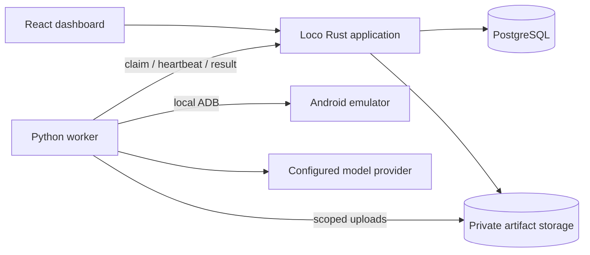

# Mobile QA MVP — master implementation spec

Status: canonical implementation roadmap. Spec 01 foundation and spec 03 local app setup
are implemented. Spec 02 has verified local ADB and one live Minitap demo; the full
reliability campaign and cloud qualification remain open. Spec 04 is locally implemented
with simulated HTTP and one real API-to-emulator good-path run verified; browser,
live fault/reliability and hosted acceptance remain open. Spec 05 authoring/review/default-plan source and simulated HTTP acceptance are locally
implemented; rendered UI and UI-triggered real-device acceptance remain open. See its
[implementation report](../../../.claude/PRPs/reports/05-test-library-and-plans-report.md).
Specs 06–07 remain planned.
[Current status and evidence](../status.md) own completion claims.
This roadmap owns sequencing; [system architecture](../system.md), [contracts](../contracts.md),
[environment](../environment.md), and [development workflow](../development.md) own their current details.

## Outcome

A customer uploads an Android test APK, supplies important journeys and a test account, reviews proposed tests, and runs an approved regression plan. The report shows expected versus observed behavior, evidence, and everything that could not be checked. Our team operates onboarding and reviews findings during the pilot.

The first engineering milestone is smaller: **one manually authored test, one cloud Android emulator, and an evidence report that distinguishes a pass, a real defect, and an unavailable prerequisite.** AI test generation comes after this works.

This packet owns implementation order and stack decisions. The [product specification](../product.md) owns detailed product semantics. These implementation decisions retain Loco/SeaORM and supersede the earlier root-layout and ts-rs browser-only contract proposals. All estimates and capacity choices require measurement; no delivery date is promised here.

## Baseline decisions

| Area             | Build with                                                                                   | Reason                                                                                    |
| ---------------- | -------------------------------------------------------------------------------------------- | ----------------------------------------------------------------------------------------- |
| Application      | Loco Rust monolith, its Axum foundation and SeaORM                                           | Reuse application conventions and scaffolding                                             |
| Dashboard        | Loco React/Vite starter, TypeScript strict, React Router, TanStack Query                     | Stay close to the starter; fast UI iteration                                              |
| Components       | Mantine packaged components                                                                  | Assemble forms, navigation, tables and dialogs                                            |
| Shared contracts | Rust/Utoipa → OpenAPI → generated TypeScript SDK + Zod; worker DTOs → JSON Schema → Pydantic | Authoritative shapes, endpoint descriptions and runtime boundary validation               |
| Persistence      | PostgreSQL                                                                                   | Product records, manifests, leases and durable jobs                                       |
| Execution        | Python/uv adapter around a pinned Minitap mobile-use version                                 | Reuse device interaction; keep Python narrowly scoped                                     |
| Artifacts        | Local private directory in development; private S3-compatible storage for pilot              | APKs, screenshots, logs and available recordings                                          |
| Hosting          | Railway application + PostgreSQL initially; separate qualified Linux device host; AWS later  | Move quickly while retaining portable deployment boundaries; see [hosting](../hosting.md) |

Start with the starter's routing rather than replacing it with TanStack Router. No SSR or production Node server is required for this dashboard. Loco background workers run Rust code; our Python device worker needs the explicit HTTP lease protocol in spec 04. No second agent framework is needed to control the same device loop.

Runnable applications live under `apps/api`, `apps/web` and `apps/mobile-worker`; shared Rust definitions stay in `crates/contracts`. Loco uses backend scaffolding inside the API directory, with a separately generated browser client. The foundation integration has been verified; new framework changes still require appropriate checks. Preserve a boring working scaffold rather than upgrading every dependency to its newest release.

## Ordered smaller specs

| Order | Spec                                                                       | Observable completion                                                       |
| ----- | -------------------------------------------------------------------------- | --------------------------------------------------------------------------- |
| 1     | [Source setup and fast development](01-source-setup-and-fast-dev.md)       | Working starter, one typed endpoint, cached checks, fake-worker development |
| 2     | [Cloud phone and execution feasibility](02-cloud-phone-and-feasibility.md) | Real emulator runs a fixed case and captures trustworthy evidence           |
| 3     | [App setup and first UI/backend slice](03-app-setup-and-ui-backend.md)     | Sign in, create app, upload APK, see real readiness status                  |
| 4     | [Run one test and report](04-execution-and-reports.md)                     | Browser → durable job → Python → phone → persisted report                   |
| 5     | [Test cases, suites and plans](05-test-library-and-plans.md)               | Edit, review, version and rerun approved definitions                        |
| 6     | [Generate tests](06-test-generation.md)                                    | Sources become reviewable drafts that can actually execute                  |
| 7     | [Regression, pilot readiness and scaling](07-pilot-readiness-and-scale.md) | New-build comparison, recovery, measured reliability and costs              |

Dependencies: 01 → 02 and 03; both 02 and 03 → 04 → 05 → 06 → 07. Work on the small App screen can continue while infrastructure access is pending, but device qualification gates real execution. Avoid completing a large UI before proving the runner.

## Concurrent execution plan

Complete spec 01 and its post-implementation verification first. It establishes the shared scaffold, package versions, development commands and contract export conventions. Do not have several contributors scaffold or replace the application independently.

| Wave | Work that can run concurrently                                                             | Gate before proceeding                                                                   |
| ---- | ------------------------------------------------------------------------------------------ | ---------------------------------------------------------------------------------------- |
| A    | Spec 01 only                                                                               | Complete setup, then verify the starter and export path                                  |
| B    | Spec 02 cloud/device adapter + spec 03 app setup                                           | Device qualification and persisted app/build setup both complete                         |
| C    | Spec 04 divided into Rust scheduling/report APIs, Python protocol integration, and Runs UI | Agree on the protocol first; integrate all three and verify the real end-to-end workflow |
| D    | Spec 05 test library + the independent operational subset of spec 07                       | Approved/versioned cases and plans work; operational work cannot claim pilot readiness   |
| E    | Spec 06 generation + remaining independent deployment/retention work from spec 07          | Generated drafts execute through the same approved workflow                              |
| F    | Remaining spec 07 regression integration and pilot qualification                           | Completed system passes the full pilot acceptance gate                                   |

For a small team, use two workstreams after setup: **device/worker** and **product UI/backend**. Split into three for spec 04 only if coordination is useful. These are scheduling recommendations, not instructions to launch agents or paid cloud resources now.

### Ownership and shared-file rules

- In wave B, the device stream owns `apps/mobile-worker/` and device-host files under `infra/`; the product stream owns app/auth/build modules, their migrations and App UI. Spec 02 can use a standalone case fixture and evidence output without waiting for spec 04's worker HTTP protocol.
- In wave C, one Rust/API owner defines worker/browser DTOs, route behavior, state transitions and representative JSON fixtures before the worker and UI streams implement consumers. This is a narrow handoff inside spec 04, not a new whole-product contract project. Consumers use the agreed contract and fixtures while their endpoint implementations are being written.
- Give `crates/contracts/`, generated outputs, migration registration, root manifests/lockfiles and shared route registration one integration owner. Other contributors request changes instead of editing these simultaneously. Domain migration files may have separate owners and unique identifiers; registration is coordinated.
- Separate UI feature files from shared navigation/components. Backend work and UI work can proceed against agreed interfaces, but a mocked screen does not satisfy a spec's real integration acceptance criteria.
- Spec 07's early operational subset means deployment configuration, retention machinery using established artifact records, backup/restore instructions and metrics already defined by execution. Defer comparison against final case versions, generated-case evaluation and complete pilot sign-off until their inputs exist. Coordinate any shared services or migrations with the owning feature stream.
- Each workstream finishes its complete agreed implementation before running checks. In a shared checkout, coordinate an explicit verification window so checks do not run against another contributor's unfinished edits. Isolated worktrees may verify their completed scope independently. Generate shared outputs once at integration; batch fixes and rerun affected checks only. No check watchers or per-edit verification.

Do not start all seven specs together. Spec 04 depends on actual device behavior and build records; spec 06 depends on the approved case/plan model. Starting those complete implementations prematurely would require assumptions and rework.

## What to build first

1. Bootstrap only enough repository structure to run Rust, React and a standalone Python adapter.
2. Choose one controlled demo APK and write its expected result manually. Supply a known-good build, a deliberately broken build, and a missing-prerequisite scenario.
3. Boot a cloud emulator, install the APK, run the fixed test, collect evidence, and reset. Repeat to expose contamination and flaky results.
4. Connect a small App page and Run button to that proven path. Add reporting before generation.

This order answers two separate meanings of “test”: a **customer test case** is the first product input; **automated tests of our own platform** accompany important contracts, state transitions and access boundaries. We do not write an enormous test suite or build a complete test editor before the first device run.

## Initial user interface

- **App:** package/build, test environment, account readiness and current device profile.
- **Tests:** cases grouped into suites; generation and review; one default plan initially.
- **Runs:** submit, progress, evidence, comparison, retry and triage.
- **Settings:** members/access, secret references, execution limits and retention.

Create these routes early, but implement screens in the order above. Device pools, worker credentials and infrastructure operations are operator concerns. The customer should not need to understand ADB, KVM or Python.

## Architecture and invariants

Rust owns authorization, expectations, approvals, job state and result aggregation. The worker reports observations; agent completion alone does not prove correctness. Any model-assisted verification is labeled and retains its evidence.

Runs bind immutable build checksums, case versions, plan version, device configuration, reset policy and model/adapter configuration. A missing required execution cannot become green. A retry preserves every attempt. Device/account lease expiry never authorizes blind replay of a potentially completed side effect.

Persist organization/project scope from the first real API slice. Begin with one qualified Android configuration, one active case per device, and one pilot project per worker host. Distinct customer environments require isolation before sharing capacity.

## Development speed rules

Follow the canonical [development workflow](../development.md): complete the whole scoped
implementation before running generation/checks, keep strict settings, and rerun only
failed or invalidated checks after batched fixes. CI selects affected apps and contract
consumers. Vite HMR is allowed; type/lint/test watchers and Rust rebuild watchers are not.
Runtime secrets use [Doppler](../environment.md); no env files or examples.

## Risks and decision gates

| Risk                                                                         | Resolve before                           |
| ---------------------------------------------------------------------------- | ---------------------------------------- |
| APK ABI, emulator detection, Play services or login incompatibility          | Promising a pilot configuration; spec 02 |
| Upstream SDK evidence/reset/cancellation behavior differs from documentation | Building execution integration; spec 02  |
| Loco scaffold and generated types do not integrate cleanly                   | Domain scaffolding; spec 01              |
| Worker reports false passes or reruns uncertain mutations                    | Customer use; specs 04 and 07            |
| First customer needs iOS/physical devices                                    | Selling Android coverage as sufficient   |
| Device/model/human time makes the offer uneconomic                           | Fixed-price expansion; spec 07           |

This specification does not authorize a cloud purchase. During implementation, prepare the provider configuration and current cost estimate before requesting authorization to create paid resources. Until then, local execution and fake-worker development remain useful.

## Evidence sources

Framework basis: [Loco typed React SPA](https://loco.rs/docs/how-to/build-a-spa/) and [Loco background processing](https://loco.rs/docs/explanation/background-processing-model/). Exact source-setup and cloud runbooks cite their own technical references. Product reliability requirements are our proposed acceptance criteria, not vendor performance claims.
