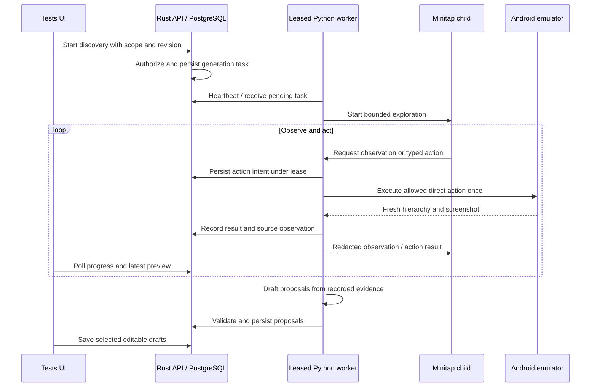

# 08 — Minitap flow discovery

Status: **implemented; automated checks and real sample discovery/direct replay passed** (2026-09-14).
Depends on: spec 06 direct execution, phone sessions, generated contracts and proposal review;
spec 02 qualification for the selected app/device/model. This is a separate follow-up to 06;
it does not require completion of the independent spec 07 scaling work.
Owners: Rust orchestration and validation; Python Minitap integration and device recording;
React discovery controls and proposal review.

## Product outcome

As a tester, I want AI to explore an app and suggest named tests, so I can review useful
coverage without manually specifying every tap. Saving a suggestion creates an editable
test. Subsequent runs execute its recorded direct actions without AI calls.

This implementation replaces the custom structured-model discovery loop with the pinned
Minitap agent graph. Direct execution, explicit Ask AI, manual editing, templates and the
existing approval/reporting flow remain available. Real-device qualification gates are
reported separately from source implementation in status.md.

## Tester flow

1. In Tests, choose **Generate with AI**. Reuse the selected app, validated build and
   available qualified phone profile. Open the phone automatically after this explicit
   action when the selection is unambiguous; otherwise request only the missing choice.
2. Default to **Smoke**. Offer Happy path, Validation and Persistence, an optional journey
   such as “Explore adding and saving a task”, and a collapsed scope section. A test-data
   interaction opt-in is necessary before taps or typing; show that requirement beside Start.
3. Click **Explore with AI**. Keep the compact task area left and phone preview right.
   Show Exploring, Drafting tests, Ready to review, or a specific reason exploration stopped.
   Display observed screen/action counts, model usage and Stop. Disable simultaneous phone
   control while discovery owns the session command lane.
4. Show up to five editable proposals with names, category, compact ordered actions,
   optional checks, source screenshots and unanswered questions. Examples include
   “Smoke — task screen opens” and “Saved task remains after restart”, only when supported
   by the actual observations. Never promise to find every flow or every screen.
5. Select proposals and **Save tests**. Generate internal stable keys automatically. Reuse
   existing atomic save receipts. Saving does not approve or execute a test. A saved draft
   can be tried through the existing direct runner; release runs still use reviewed versions.

Use “AI” in tester-facing buttons, descriptions and status messages; Minitap remains the
internal integration name. While the phone opens, allow editing the exploration instructions
and explain that exploration becomes available when the phone is ready. An incompatible
session is shown as connected with AI unavailable, with a Reconnect phone action that waits
for cleanup before reopening. Reconnecting does not promise to upgrade server capabilities;
worker deployment remains an operator responsibility, never a tester setup instruction.

Smoke and the other coverage presets provide a visible bounded default journey when the
optional custom instructions are empty. The exploration UI requires explicit permission to
tap, type and change test data before starting; leaving it unchecked sends no generation
request. This avoids paying for a screen-only exploration that cannot record a usable flow.

The preview shows a live activity list from persisted action intents and outcomes, with a
spinner while queued/exploring/drafting. A target highlight appears only for a pending tap or
text action with a unique selector on the exact before-action frame. It is not a continuous
cursor stream; quick actions can finish between UI polls, but remain in the numbered list.
Terminal tasks without proposals say **No tests generated**. Gap codes become actionable
language. Suggested tests appear before collapsed exploration evidence. Each proposal shows its name,
requirement, numbered actions and expected checks in a compact list; editing is expandable.
Saved AI proposals display an **AI generated** badge in the library and entry header. The API
derives this from stored proposal provenance, including older saved proposals and edited drafts;
manual recordings and templates do not receive the badge.

Suggestions start selected, with selection controls only for multiple proposals. One sticky
**Confirm & save** action explicitly confirms expected behavior and saves the selected drafts;
there is no separate confirmation checkbox. Save failures preserve edits, and successful saves
disable repeat submission and show links to the saved drafts. Screenshots stay in one horizontal
strip inside the collapsed evidence section. Proposal cards put action/check counts beside the
title and keep the action recipe visible. Follow-up questions share one collapsed **Review notes**
section with a question count; the duplicate-name notice remains an inline signal outside it.
Neither disclosure hides the proposed expected checks that the tester confirms when saving.
The compact card passed one GAN source-review iteration (8.225/10) on 2026-09-15.
Rendered-after acceptance remains unverified; the supplied screenshot is the before state.

Keep model names, selector IDs, protocol versions and token configuration out of the main
setup form. Put costs and provenance in expandable details. Templates and manual tests must
remain available without model credentials. Page load, APK upload and selector failure never
start discovery automatically.

## Ownership and execution

Use existing phone tasks, reservations, leases, heartbeat, cancellation, private artifacts
and library mutations. Do not add Redis, Celery, a second queue or a separate service.
Generation holds the same exclusive device lane as manual commands. Database transactions
must finish before device or model I/O.

The Python parent owns device access and the API worker credential. Minitap runs in an
isolated subprocess with model credentials injected through Doppler, matching the existing
SDK adapter. It requests operations through a bounded local broker. The parent validates
the request, fences the lease, records intent, calls the existing direct executor, captures
the outcome, and acknowledges it. Minitap chooses what to explore; the broker performs and
records device operations. This still uses the Minitap planning/execution graph, rather than
the retired one-action model loop.

## Pinned SDK integration

Start with the installed `minitap-mobile-use==4.0.0`. Its `Agent.run_task` and graph callback
configuration already have a local integration in `qualification/sdk_adapter.py`.
The existing `sdk_compat.py` performs a process-local, version-checked ToolNode adaptation.

The installed graph exposes `EXECUTOR_WRAPPERS_TOOLS`, `ExecutorToolNode` and `ContextorNode`
as module references. Add a discovery-only adaptation that supplies broker-backed tools and
a broker-backed contextor before building the agent graph. Preserve sequential tool execution
and expected LangGraph state/message updates. Use clearly documented local compatibility
code; never edit installed packages or change the explicit Ask AI path implicitly.

Important observed constraints:

- Default SDK tap logic tries coordinates and alternate locators after errors. Discovery
  must replace that behavior with one validated direct operation and no retry after an
  uncertain effect.
- Default ContextorNode reads device data directly and can ask a model to permit an app-lock
  deviation. Replace its observation path and enforce package scope in the parent. An SDK
  `locked_app_package` option alone is insufficient enforcement.
- Graph callbacks expose model usage; they are not an action-policy boundary. Count all
  model roles, retries and fallbacks before provider invocation. Do not assume one agent
  step means one model call or one device operation.
- Upstream logs can contain tool arguments. Keep logs private and sanitized, disable telemetry,
  and ensure screenshots, hierarchy, tool results and traces are redacted before model use.

An offline conformance gate must prove every agent device/observation path uses the broker,
including initial setup and app recovery. Unsupported SDK behavior fails with a clear
capability error before exploration. Do not silently fall back to the old custom loop.
The child process is an integration boundary, not a claim of an OS security sandbox.

Expose only supported broker tools to the explorer: tap, replace text, swipe, back, restart
and observe/wait for a control. Tool descriptions must match direct semantics: replace text
does not mean append text. Omit native shell, URL opening, arbitrary app launching, key presses,
long press, file/scratchpad and recording tools for this first version. Disabled tools must
also be rejected if an injected or malformed tool call names them.

## Recording and evidence

Persist an append-only discovery journal under the existing generation task. Each operation
has a unique sequence ID, before-observation ID, canonical `DirectCommand`, intent receipt,
outcome and after-observation ID when known. State observations reference the exact app,
build checksum, environment revision, device image, session and capture. Record package and
a normalized hierarchy fingerprint for grouping similar screens; screen grouping is not
proof that two application states are interchangeable.

Resolve a target against fresh hierarchy immediately before acting. Prefer a unique resource
ID, then a supported unique accessibility description. If the agent proposes coordinates,
bind them to one eligible element and a reusable selector first. Missing, ambiguous, password,
disabled or out-of-app targets stop that operation. Do not save coordinates or frame-local
IDs as reusable selectors. Repeated element IDs must not default silently to the first match.

Publish and acknowledge intent before an effect. Retried broker messages with the same ID
and content return their prior receipt; changed content conflicts. Lost responses, crashes
and timeouts after intent are uncertain and must never cause automatic action replay.
Retain partial evidence and apply existing cleanup/quarantine rules.

Drafting may reuse the existing structured proposal model call after Minitap finishes. Feed
it recorded commands, ordered observation edges and redacted evidence, not private agent
reasoning or an unverified natural-language success summary. Enforce these result distinctions:

| Result                      | Meaning                                                               | User action                               |
| --------------------------- | --------------------------------------------------------------------- | ----------------------------------------- |
| Observed flow               | Exact ordered path was performed during discovery                     | Review and save a direct test             |
| Test idea                   | Suggested edge case or expectation was not observed / cannot be bound | Resolve questions before a runnable draft |
| Trial passed/failed/blocked | Existing direct trial produced actual evidence                        | Inspect its independent report            |

Only replayable observed paths enter the executable proposal list. Unobserved edge cases
appear as ideas/questions, never invented commands with fabricated source IDs. Proposal
validation must verify a contiguous journal path, not just that each selector appeared
somewhere. Start from the recorded initial state; a non-initial segment needs its observed
setup prefix. Missing reset/setup prerequisites remain explicit.

Observed text is not automatically the intended result. Require the tester to confirm proposed
expectations using the existing review rules. Action-only trials remain legal; a generated
test with no checks does not claim behavioral correctness. Editing actions or bindings makes
the draft user-modified; preserve source provenance without presenting the edited sequence as
an unchanged observed path. Never stamp a proposal “passed” because the agent finished.

## Scope, budgets and cancellation

Default observation-only mode permits screenshots and hierarchy inspection. Full flow
exploration needs an explicit test-data interaction scope and a journey. The current
allow-writes flag authorizes interactions within that qualified test environment; neither
button text nor the model can reliably prove an arbitrary tap harmless. No production
exploration, login automation, external apps or security exploitation is included.

Initial limits reuse the current product envelope: 180 seconds total exploration plus
drafting, 12 direct operations, 8 distinct stored observations, 5 proposals, 20 steps per
proposal and 16 provider calls across all agent roles and drafting. Reserve one provider
call and time for drafting; stop earlier when necessary. Count unsuccessful calls; unknown
usage stops further calls. Apply a per-call output limit and serialized-input byte limit in
the model wrapper; use the smaller of remaining deadline and existing profile timeout.
These limits are a starting point to qualify, not a performance or dollar-cost guarantee.

Fresh captures are necessary for each action even after a repeated screen. A repeated identical
observation can reuse a stored snapshot; a changed observation cannot overwrite one. Stop
before another action if its result cannot fit the remaining evidence budget. Keep failures
and partial outcomes visible rather than increasing budgets automatically.

The parent remains responsive to heartbeat and Stop while the child is running. On cancellation,
stop accepting broker actions, terminate the entire child process group, retain prior evidence
and close/clean the owned device according to session rules. If cleanup or action outcome is
uncertain, quarantine it. A resumed page only reads progress; it never resumes side effects.

## Contracts and compatibility

Rust remains the single source for browser and worker transport types. Extend existing
generation contracts with engine identity, versioned journal/observation references and
proposal provenance. Keep all fields on historical records backward-readable; absent engine
means legacy custom discovery for old stored jobs. Do not rewrite existing definition hashes,
approvals, templates or frozen manifests.

Use phone protocol 3 to advertise Minitap discovery support. Protocols 2 and 3 both support
direct actions; only 3 accepts a new Minitap discovery request. Update exact `== 2` comparisons
in API, worker and UI together. Protocol 0 remains legacy-compatible. An old browser omitting
the new engine receives a useful upgrade error for a new discovery request; historical jobs
remain readable. An existing protocol-2 session must reconnect before Minitap discovery.

Reuse existing generation endpoints and task JSON storage. API validation must enforce engine,
scope, size, counter monotonicity, append-only receipts, legal progress transitions, known
source IDs and contiguous proposal paths. Browser success/error boundaries use generated Zod;
Python inputs, broker messages and results use Rust-generated Pydantic shapes. The broker
uses bounded newline-delimited messages with IDs and constrained private artifact references;
do not accept arbitrary child-provided filesystem paths or executable strings.

Reusing observations may skip exploration and call only the proposal generator when engine,
app/build/environment/profile/session, scope and source journal match. Record the source job
and separate current usage from historical usage. Category changes may redraft that evidence;
changes to journey, write scope, build or environment require new exploration.

## Delivery and acceptance

1. Specify and implement generated contracts, the broker, the pinned SDK adaptation and offline
   conformance tests. Keep the feature unavailable until enforcement and recording are proven.
2. Integrate API validation/protocol support and the existing discovery UI. Remove the superseded
   executable custom discovery branch, its prompts and dead-only tests after replacement coverage
   exists; retain legacy readers and the structured proposal generator.
3. Validate fake-model/device tests, real HTTP persistence/restart/fencing tests and the normal
   direct-authoring regression smoke. Then explicitly qualify a real Minitap exploration on the
   existing sample APK and record actual usage and replay evidence.

Acceptance requires all of the following:

- Minitap `Agent.run_task` actually drives exploration; fake-agent tests are labeled synthetic.
- No native SDK action, screenshot or app-recovery path bypasses policy, redaction or recording.
- One observed enter-text → save journey yields an editable named proposal with real sources.
- Saving twice with the same mutation identity creates one batch; cross-app saves are rejected.
- A saved direct test replays successfully on the qualified sample from a documented initial
  state with **zero model calls**, including a Unicode input case. A deliberately wrong expected
  value produces failure under the existing evidence evaluator.
- Unknown targets, interrupted effects, login, external apps, lack of reset, model timeout and
  exhausted budget produce truthful partial/blocked states without hidden retries or fake passes.
- Stop prevents new device actions and cleanup preserves exclusive ownership and quarantine.
- Existing direct/manual/template behavior and immutable historical definitions remain valid.
- Rendered discovery/proposal UX is checked by an authorized browser path; if access is denied,
  record this gate as open rather than bypassing the restriction.

## References

The official [Minitap Agent reference](https://www.minitap.ai/docs/mobile-use-sdk/sdk-reference/agent)
documents initialization, task execution and cleanup. Its latest examples may differ from our
pinned version; local 4.0.0 source and lockfiles determine implementation details. The
[upstream repository](https://github.com/minitap-ai/mobile-use) is the dependency source.
The guarded broker and recording rules above are our integration, not a documented
upstream policy-hook feature.

## Implementation notes

The discovery child calls actual `Agent.run_task`, with native planner, orchestrator,
cortex and sequential executor nodes. It deliberately does not call `Agent.init`: native
init creates an additional device client and captures an unredacted screen. The leased
parent already initialized the phone, so the child receives device metadata and no native
clients. Contextor, foreground lookup and screenshot compression are adapted as well as
the tool registry. Only the parent may observe or execute a generated `DirectCommand`.
The exact SDK/version guard and offline graph conformance test protect this adaptation.

The parent records acknowledged pending intents before effects; terminal receipts are
immutable. Proposal commands must be a completed journal prefix with before/after sources.
Passive redraws (for example cursor blinking) may add observations between operations;
source order must remain chronological and no recorded operation may be skipped. The
model's strict generated draft schema selects a prefix by action number and assigns
checks to action numbers. Code constructs commands, action/checkpoint IDs and source
references from the journal; the model cannot invent these identities.
An uncertain action halts the child and closes the session; it is never automatically retried.
Reuse only redrafts evidence from a completed, matching-scope job in the same session.
Saved edited sequences carry `user-modified` provenance and do not claim observed replay.
No database migration is required because phone tasks already store validated JSON.

Explicit acceptance command:
`just smoke-minitap-discovery /absolute/qualified-profile.toml /absolute/sample.apk`.
It exercises real discovery, saving a named draft, direct replay and an independently wrong
assertion. Same-session replay does not qualify clean-reset replay or arbitrary APKs.
Browser rendering and broader device qualification remain separate acceptance gates.
