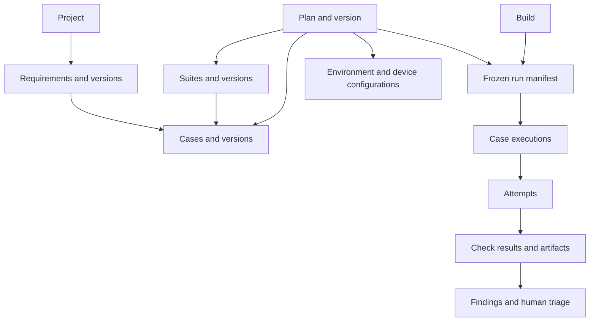

# Design: Mobile QA service MVP

Status: canonical MVP product requirements and proposed pilot terms, consolidated
2026-09-12. The engineering foundation is implemented; the customer-facing workflow
and device execution remain planned. See [current status](status.md).

User stories, domain meaning, approval authority, result rules and proposed pilot
boundaries belong here. Customer demand, pricing, device reliability and pilot acceptance
are not established by this document. Earlier office-hours review covered the original
product draft, not every later technical change. [System architecture](system.md) and
[implementation roadmap](implementation/00-master-spec.md) own engineering decisions.

## 1. Product decision

Build a web application backed by an operated mobile QA service. Customers provide a test build, test account, and important user journeys. We help them turn that input into an approved test suite, run it on subsequent builds, and deliver evidence that explains which checks passed, failed, or could not be completed.

Working architecture: reuse Minitap mobile-use for device interaction; use OpenAI models for structured drafting and evidence interpretation; use ordinary application code for scheduling, state transitions, permissions, and result aggregation. OpenAI Agents SDK is optional, not required for the first version.

The customer buys a repeatable release check with someone responsible for reviewing findings. The interface supports that service. It should not require the customer to become a test automation engineer.

Initial target: a small mobile team releasing frequently without a dedicated automation specialist. Buyer hypothesis: founder or engineering lead; daily user: developer; initial operator and report reviewer: our team. The customer owns approval of business expectations. This is a proposed segment, not a validated customer profile.

Initial delivery boundary: Android APKs, one approved emulator configuration, a test backend, and about 5–10 critical journeys per pilot app. Physical Android is a separately qualified configuration. iOS is a follow-on decision unless the first paying pilot requires it. Emulator results must be labeled as such.

## 2. Problem statement, evidence, and status quo

The founder reports four pains: testing phones is difficult; regression testing repeats effort; releases feel unsafe without testing; local frameworks are expensive or inconvenient. They intend to build an MVP and sell it.

No named customer, measured current testing cost, signed pilot, or willingness-to-pay evidence has been supplied. Public competitor offerings establish that this category exists; they do not establish demand for this particular service.

| Pain | Likely current workaround, to verify | Product response | Pilot measurement |
|---|---|---|---|
| Setup takes effort | Developer installs builds and maintains devices | Guided build intake and managed execution | Operator/customer setup minutes |
| Regression work repeats | Someone taps through a checklist each release | Save approved cases and rerun them | Human minutes per release before/after |
| Nobody knows what was covered | Ad hoc checks and messages | Plan manifest with explicit included and excluded checks | Missing critical journeys identified |
| Failures are hard to reproduce | Screenshot or vague bug message | Evidence linked to build, case, device, and attempt | Time from report to reproduced bug |
| Tests get stale | Fix scripts or skip checks | Propose versioned changes for review | Review effort and stale-case count |
| Release uncertainty | Ship and watch for complaints | Scoped result summary and unresolved blockers | Release delays and escaped defects |

Premises for this draft: repeatable regression is the first product; test generation reduces authoring work but cannot establish business truth; human review is part of initial service delivery; no result guarantees that an app is bug-free or will receive App Store approval.

## 3. User stories and acceptance criteria

| ID | User story | Acceptance criteria for MVP |
|---|---|---|
| US-01 | As a developer, I want to register my app and upload a build so testing can start without installing a framework. | Identify app/package and build checksum; reject unsupported/corrupt files; report install/preflight errors separately from test failures. |
| US-02 | As a product owner, I want to explain what must work so tests reflect intended behavior. | Accept pasted stories and acceptance criteria; preserve source versions; highlight missing prerequisites and unclear expectations. |
| US-03 | As a QA operator, I want AI to draft tests so I can review instead of starting from a blank page. | Each draft has a source, expected outcome, prerequisites, test data needs, and verification method; unsupported claims are marked as assumptions. |
| US-04 | As a reviewer, I want to edit and approve cases so the AI cannot define correctness by itself. | Drafts cannot enter normal regression runs; approvals record actor/time/version; edits to approved content create a new draft version. |
| US-05 | As a developer, I want suites for onboarding, login, and other features so tests are reusable. | Add/remove/reorder case references; allow one case in several suites; prevent duplicate execution of the same case variant in one plan. |
| US-06 | As a release owner, I want a test plan so I know exactly what this release check includes. | Save coverage, environment policy, suites/cases, device configuration, required checks, budgets, and retry policy; bind a build when starting a run and preview resolved cases and gaps. |
| US-07 | As a developer, I want visible run progress so I know whether to wait or intervene. | Show queued/running/finished states, current case, elapsed time, cancellation, and setup blockers; disconnecting the browser does not lose the job. |
| US-08 | As a developer, I want an evidence-based failure report so I can reproduce and fix the issue. | Show expected/actual, failed check, exact attempt, screenshots/video where available, logs, build/device identifiers, and replayable instructions. |
| US-09 | As a release owner, I want to rerun the suite on a new build so I can detect regressions. | Pin approved versions; preserve old results; distinguish comparable changes from new/changed tests and environment differences. |
| US-10 | As a reviewer, I want to triage findings without erasing evidence. | Confirm bug, expected behavior, duplicate, or needs investigation; keep machine outcome and original artifacts immutable. |
| US-11 | As a customer, I want my app and credentials accessible only to authorized people. | Project-scoped access controls cover metadata, builds, run controls, and artifacts; secrets are references, never embedded in cases or exported reports. |
| US-12 | As an operator, I want bounded jobs so one broken app cannot consume unlimited time or money. | Enforce time/step/token budgets outside model prompts; preserve partial evidence; use an explicit inconclusive result when limits are reached. |

## 4. Domain model: plan, suite, case, and run

These are separate objects. A plan is not a folder containing copied suites, and a test definition is not its most recent execution result.

| Object | Meaning | Example |
|---|---|---|
| Project | Customer app boundary for builds, sources, tests, and access | PocketTasks Android |
| Requirement / user story | Intended user outcome with acceptance criteria | A returning user can sign in |
| Test case | One independently verifiable scenario | Incorrect password does not sign the user in |
| Test suite | Reusable collection of case references | Authentication regression |
| Test plan / release check template | A reusable, versioned choice of coverage and execution policy, without a fixed build | Standard release authentication and task checks |
| Build | Immutable uploaded application binary and identity | APK SHA-256 + version 1.4.0 |
| Environment | Backend endpoint, fixture/reset method, and capability profile | Staging with seeded test accounts |
| Run | Execution of a frozen plan manifest against a build | RUN-1042 |
| Case execution | One case-version/data-variant/device combination in a run | AUTH-002 v1 on emulator configuration A |
| Attempt | One try at that case execution | Attempt 1, then permitted diagnostic retry |
| Check result | Evidence for one expected outcome | Error visible; authenticated session absent |
| Finding | Reviewable potential defect linked to evidence | Invalid-password login appears accepted |

Relationships:



Plans reference approved suite and case versions. At run creation, bind the chosen build and actual environment revision, then resolve all memberships into explicit case-version IDs, data-variant IDs, and device configurations. Later edits cannot alter that manifest. In this MVP, "test plan" and "release check template" name the same reusable object; a run manifest is its build-bound snapshot. Updating the build alone needs no case reapproval; changing required coverage or environment policy creates a new plan version for review. Selecting newer approved cases also creates a new plan version, avoiding silent scope changes.

The deduplication key is `(case_version_id, data_variant_id, device_configuration_id)`. If two selected suites contain the same case variant, run it once. If versions of the same logical case conflict, require selection rather than silently running or dropping one. Case ordering is for readability and cost planning; cases must not depend on an earlier case having passed.

## 5. What belongs in each object

### Test case

Required fields: stable ID, version, title, project, requirement/acceptance-criterion references, provenance, priority, platform/capabilities, preconditions, test-data references, actions, expected checks, evidence requirements, setup/reset/cleanup strategy, maximum duration/steps, author/reviewer, and lifecycle status.

Each expected check specifies its verification method: exact UI/property comparison, configured read-only backend verification, visual judgment, or manual check. An assertion is a check of an expected result, not simply an action the agent attempted.

Keep semantic actions such as “enter the invalid password and submit” in the case. Runtime coordinates and selectors belong in the execution trace. They can be execution hints; changing them must not relax the approved expected behavior.

Lifecycle: Draft → Needs clarification or Ready for review → Approved → Deprecated. Only immutable Approved versions can be used for release regression. A superseding version does not delete the earlier one. Reviewed exploratory draft trials are explicitly marked discovery and cannot produce a release-passing summary.

### Test suite

Required fields: stable ID/version, name, purpose, owner, ordered case-version references, tags, and status. Examples: Authentication, Core task management, and Release smoke tests. A smoke suite is a small set of checks that catch major breakage quickly.

Suite generation proposes memberships and an explanation. Creating 50 cases does not prove good coverage. Prefer a small set mapped to explicit critical criteria, without duplicates or invented requirements.

### Test plan

Required fields: ID/version, objective, compatible app/package and build-selection rules, environment policy, suite/case selections, device matrix, required check list, exclusions with rationale, preflight requirements, execution budget, retry policy, reviewer/owner, baseline-selection rule if supplied, and result aggregation policy. The build ID, actual environment revision, and chosen baseline-run ID are bound in each run manifest.

Plan lifecycle: Draft → Ready for review → Approved → Deprecated. Only approved versions launch release runs. Baseline selection is explicit; the system may propose the latest comparable run but never silently replace a customer-accepted baseline. Suite membership changes likewise create a new version; approval resolves all member cases and required-check mappings.

The MVP UI should offer a default “Release check” template. The operator should not have to create all these objects manually for each run. The app proposes the plan, displays the selected cases and gaps, and asks the authorized reviewer to confirm its scope.

## 6. Worked example: intended behavior to repeatable tests

Synthetic example only. No customer evidence is implied.

**User story:** As a returning PocketTasks user, I can sign in to access my saved tasks.

**Acceptance criteria:** AC-1: valid credentials open that user's task list. AC-2: invalid credentials show the agreed error and do not create an authenticated session. AC-3: signing out removes access to protected tasks. Password reset, lockout thresholds, session duration, and offline behavior are unspecified; generation should ask about them or propose unapproved candidates.

| Case | Scenario | Expected evidence | Suite |
|---|---|---|---|
| AUTH-001 | Valid sign-in | Known test user's task list appears | Authentication; Smoke |
| AUTH-002 | Incorrect password | Agreed error; no authenticated session | Authentication |
| AUTH-003 | Sign out then attempt protected access | Login required; protected content inaccessible | Authentication; Smoke |
| TASK-001 | Create a task and relaunch | Named task persists after relaunch | Task management; Smoke |
| TASK-002 | Complete an existing task | Completion persists in the expected list/state | Task management |

TASK-001 and TASK-002 require their own approved task-management requirements; the login story does not authorize inventing them.

**Expanded AUTH-002 v1:**

- Priority: high; requirement: sign-in AC-2; Android; owner: assigned pilot reviewer.
- Setup: clean app session; staging account seeded and available; invalid-password attempt must not trigger an unknown lockout policy. If the policy is unknown, resolve before approving this case.
- Test data: `staging_user` credential reference and a designated invalid password fixture. Never store the real password in the case body.
- Actions: open sign-in, enter the test email and invalid password, submit, observe error, then attempt the agreed protected navigation.
- Checks: agreed error visible; protected task list inaccessible; optional authoritative session check only if a customer-approved verification endpoint exists.
- Evidence: error screenshot, protected-navigation observation, redacted action trace, and backend verification response if configured.
- Pass: all required checks supported by evidence. Seeing an error alone is insufficient if protected access was not checked.
- Fail: observed behavior contradicts a required check. Inconclusive: navigation or evidence does not establish the outcome. Blocked: staging/reset/account prerequisites unavailable.
- Cleanup: revoke any test session and clear local state through approved reset; quarantine the worker if cleanup cannot be established.

**Example plan:** Standard release check v1; one Android emulator profile; Authentication v1 and Task management v1; five unique cases; clean fixture per case; no real purchases; one original attempt with at most one policy-permitted diagnostic retry; 30-minute run cap. Starting this plan against release 1.4 binds that build's checksum in the manifest. Device/OS selection is qualified during feasibility, then pinned. This example cap is a proposed default, not a measured performance claim.

## 7. Generation pipeline

Generation is an asynchronous, versioned draft job. It does not immediately run or approve tests.

### Stage 1: Gather inputs and check readiness

Minimum useful input: a supported build, user journeys with at least one expected outcome, environment identity, test-data/credential references, and allowed operations. If only a build is supplied, offer discovery; label the output observed behavior and candidate questions.

MVP sources are pasted text and operator-entered notes. Repository, ticket, recording, and document connectors are later additions. Store source revisions so generated content can cite exactly what it used.

Perform package/install, backend reachability, account, reset, and device-capability checks before promising an executable suite. Report missing inputs in plain language: “We need a way to reset the test account before this case can run.”

### Stage 2: Normalize requirements

Ask the model for schema-constrained data: actor, goal, preconditions, acceptance criteria, source spans, ambiguities, and candidate risk areas. Validate the schema in code and retain the generation version and model identifier. Invalid output gets a bounded repair attempt and then a visible generation error.

Truth priority: customer-approved criteria first; supplied unapproved specifications second; source code and observed UI as supporting evidence. Conflicting sources require clarification. A screen that currently accepts an invalid password is not permission to redefine login as successful.

### Stage 3: Optional bounded app discovery

Use mobile-use on an isolated test device to map reachable screens and navigation for the supplied journeys. Log visited states, actions, screens, and capabilities. Discovery is limited by app/package, permitted external authentication surfaces, time, steps, and allowed actions. Screen text is untrusted task data.

A UI map shows what was visited, not every possible app state. Discovery can propose new scenarios, but cannot approve business requirements or run consequential operations outside the configured test boundary.

### Stage 4: Generate candidate cases

For each criterion, propose the positive path and justified negative, boundary, recovery, or persistence checks. Do not mechanically generate every category for every story. Each case must state what failure would look like, what evidence is sufficient, and what setup it needs.

Attach provenance: requirement-supported, observation-supported, or assumption needing review. Unspecified behavior becomes a question, never an automatic pass condition. Unsupported device features become manual/blocked candidates instead of executable promises.

### Stage 5: Validate and organize

Code checks required fields, references, capability compatibility, budgets, secret placeholders, and unique IDs. Detect similar drafts and propose merges for review. Estimate case count, runtime range based on measured history when available, and expected device/inference usage; show “not yet measured” before history exists.

Generate suite suggestions by feature and a small smoke selection by customer-designated critical criteria. Generate a draft plan using approved capabilities and explicit exclusions. Draft plans stay non-executable until their required cases and prerequisites are approved and ready.

### Stage 6: Human review and baseline trial

Show original source, generated case, assumptions, and expected evidence side by side. Reviewer edits, accepts, rejects, or requests clarification. Record case version and approval. A technical baseline trial checks executability and evidence collection; it does not prove the app's behavior is correct.

Approving a case defines an expectation. Approving a clean baseline establishes that those checks passed on a specified build/environment. These are separate actions. Failed or inconclusive trials remain visible and are never silently used as a passing baseline.

### Stage 7: Persist and maintain

Persist approved cases/suites/plan versions and an explicit coverage map. On new requirements or navigation failures, propose a diff: added scenario, changed prerequisite, changed navigation hint, or changed expected outcome. Expected-outcome changes always require review. Existing runs and findings keep their historical context.

## 8. Execution and result rules

1. Resolve and freeze the approved plan. Check project access and idempotency; repeated submission of the same request does not create duplicate jobs.
2. Reserve one healthy worker/device using a lease. Install the exact build and apply fixtures. One device runs one case at a time.
3. Execute a bounded case request through the mobile-use adapter. The adapter returns observations and artifacts; its success statement is not the final test verdict.
4. Evaluate each required check against recorded evidence. Prefer deterministic UI/property or customer-configured read-only backend checks. Visual checks may use an OpenAI model but must be labeled visual judgment. If evidence is ambiguous, require review.
5. Save the attempt result before cleanup. Verify cleanup and backend reset. A failed reset blocks subsequent work on that device/environment until resolved.
6. Retry only where policy permits, after reset, retaining all attempts. A failure followed by a pass is mixed evidence requiring review, never silently green.
7. Aggregate results in application code, generate a report from stored facts, and have our operator review it before pilot delivery.

| Outcome | Definition |
|---|---|
| Passed | All required checks have sufficient positive evidence on a valid attempt |
| Failed | At least one required check has evidence of behavior contrary to the approved expectation |
| Blocked | A known prerequisite or supported capability is missing/unavailable |
| Inconclusive | Execution/evidence is insufficient to establish correctness, including agent uncertainty and time limits |
| Skipped | Deliberate non-execution with recorded reason; never counted as pass |
| Canceled | User/operator canceled; preserve completed results and partial artifacts |

Check precedence within an attempt: an established functional contradiction remains Failed even if a later check is inconclusive. A worker/transport error without contradictory app evidence is Inconclusive or Blocked, not a fabricated app bug.

Run lifecycle (Queued → Preparing → Running → Finalizing → Completed/Canceled/Error) is separate from the coverage result. A completed run may contain failed or blocked tests.

Run summary rules: any unresolved failed required check gives “Failures detected”; otherwise any missing, mixed, blocked, skipped, canceled, or inconclusive required execution gives “Incomplete / review required”; only complete passing required coverage gives “Required checks passed.” Show optional outcomes alongside this label. A human waiver is an explicit release decision with owner/reason, not a change to test results.

A case execution with mixed attempt outcomes is not passed until investigated; preserve the mixed label even when the reviewer classifies it. A transport retry before any device action is safe; retrying a partially executed case requires proven reset or manual intervention.

Record model/configuration IDs, mobile-use commit, build checksum, case version, device/OS, environment/fixture revision, timestamps, retries, and artifact links. Pinning these makes results comparable; it does not make model behavior deterministic.

## 9. Regression comparison and coverage

Compare the same case version and data variant on equivalent device/environment profiles. Label build A → build B as a comparison only when this context matches; expose model/runner changes as additional differences. Distinguish newly failed, still failing, recovered, new test, changed test, removed test, and not comparable.

Coverage denominator: the approved in-scope acceptance criteria, not all screens or all conceivable bugs. Report, for example, “8/10 critical criteria have approved executable checks; 6/10 were fully verified on this build.” An exclusion or failed run does not disappear from the planned scope.

For a criterion requiring several checks, it is verified only if all required linked checks pass. Separate designed coverage, executed coverage, and verified coverage. Maintain an original source-derived criteria register so gaps excluded from the plan remain visible as exclusions, not hidden gains in coverage.

## 10. Product screens and first-use flow

User-directed simplification: three main areas, App, Tests, and Runs, plus a small Settings page. App setup is an onboarding flow within App. Generation, editing, and suite grouping live within Tests. Plans are saved execution presets exposed in the pre-run confirmation, not a separate navigation area. Overview content lives on the app page. Avoid making the customer configure agent roles or model prompts to get value.

| Screen | Primary content | Main action | Necessary states |
|---|---|---|---|
| App / initial setup | App identity, build upload, test account, journeys, readiness, latest result | Set up app / upload next build | Empty, uploading, invalid build, missing account, ready |
| Tests | Generate from journeys, review source/expectations, edit cases, group into suites | Generate / review / select tests to run | Generating, partial draft, clarification needed, approved, deprecated |
| Run confirmation, within Tests or Runs | Build, selected tests, saved plan defaults, device, budget, exclusions | Confirm scope and run | Unsupported configuration, unresolved required case, ready |
| Runs / report detail | History, progress, case outcomes, attempts, expected versus actual, evidence | Inspect failure / rerun on fixed build | Queued, running, partial, mixed retries, complete, canceled |
| Settings | Reusable environment/account/reset configuration, qualified device default, run limits, team access, retention | Update configuration | Valid, missing/expired credential, unsupported device, pending validation |

The onboarding wizard creates the underlying objects. First use: “Set up app → generate tests → review expectations → run → report.” Subsequent releases: “Upload next build → rerun approved tests → compare results.” Regeneration is optional when requirements change, not mandatory for every build. A customer supplies journeys; the operator reviews technical readiness and the proposed plan within the established business-approval rules.

Every run produces a scoped summary, including successful runs. Failures add expected/actual evidence and reproduction steps; blocked or inconclusive runs explain what prevented verification. The user can rerun after supplying a fixed build or resolving prerequisites. A report is a detail view within Runs, not a separate product area.

Settings must remain small. Collect essential setup values during onboarding and expose them here for later changes: test account/environment and reset configuration; default qualified device; time/retry limits; project access; artifact retention. Model selection, agent prompts, infrastructure management, billing automation, and notification integrations are not customer-facing v0 settings. The default onboarding values can be operator-managed; users need not visit Settings to complete a normal release check. Settings changes affect future pre-run resolutions, never historical manifests, and changes to approved environment/coverage policy follow plan-version approval.

Conceptual wireframe:

```text
TEST REVIEW                     PLAN                         RUN REPORT
Source: sign-in AC-2             Build: 1.4.0                 Required: incomplete
Case: Invalid password          Suites: Auth, Tasks          Passed 3 | Failed 1
Expected: no session            Unique cases: 5              Blocked 1
Assumption: error wording ?     Device: Android emulator     AUTH-002: inspect
Evidence: UI + session check    Reset: staging fixture v1    Expected vs actual
[Edit] [Needs input] [Approve]  [Resolve gaps] [Run]         [Video] [Attempts]
```

This is a workflow sketch. Visual styling is deferred until the product objects and flow are accepted.

## 11. Technical architecture and ownership

Implementation planning baseline: Loco (Rust, built on Axum) for the application API, generation pipeline, scheduling, verification orchestration, and reporting; SeaORM with PostgreSQL; Python only for the mobile-use execution worker. Private object storage holds builds/artifacts. Device jobs outlive HTTP requests and run on a separate qualified host. Start with a database-backed leased job protocol managed through the Rust API; Python workers have no database credentials.

Frontend planning baseline: the Loco React/TypeScript/Vite starter, preserving React Router and TanStack Query, with shadcn/ui components. Rust-owned DTOs and endpoint descriptions generate OpenAPI, then a typed browser SDK and runtime validators; worker DTOs generate JSON Schema and Python validation models. Runnable applications are separated under `apps/api`, `apps/web` and `apps/mobile-worker`. The [master implementation spec](implementation/00-master-spec.md) and its seven smaller specs own the build order, source setup, cloud emulator qualification and final stack decisions. They supersede earlier raw-Axum/SQLx and ts-rs browser-only proposals. See [current status](status.md) for implemented behavior and validation; device qualification remains open.

| Module | Owns | Does not decide |
|---|---|---|
| Web/API | Projects, permissions, uploads, review workflow, run submission | Whether a UI observation proves business correctness |
| Generation service | Structured proposals and source references | Approval or release permission |
| Scheduler/worker | Leases, install/reset, budgets, cancellation, execution persistence | Rewriting expected outcomes |
| mobile-use adapter | Bounded navigation, device observations, raw execution evidence | Final release result |
| Verification layer | Checks using the declared evidence method | Customer requirements inferred from current behavior |
| Report service | Aggregation and summaries from persisted results | Erasing failures after a retry |

Adapter boundary: execute a case against a reserved device using case-version ID, allowed operations, secret references, and budgets. Return action events, observations, artifacts, errors, and usage. Verify the chosen upstream SDK's actual event/trace formats in the feasibility phase; these interface names are our proposed contract, not asserted upstream APIs.

Initial tables/entities: organizations/users/project memberships; projects; builds; source and requirement revisions; case versions; suite versions and membership; plan versions; run manifests; case executions; attempts/check results; artifacts; findings/triage; jobs/device leases; secret-reference metadata. Runtime secrets use [Doppler injection](environment.md), not these test-definition tables. Customer secret resolution for leased jobs remains planned.

OpenAI calls draft structured data and interpret explicitly supplied observations. The product API key is server-side. Model selection follows measured validity, false-pass behavior, latency, and cost on our fixture suite. Do not assume changing mobile-use's provider/model preserves its published benchmark performance.

A future Agents SDK coordinator may call a coarse `run_case` tool or a requirement-analysis tool. It should not compete with mobile-use to own the same tap loop. Keep the adapter replaceable so we can evaluate another runner later.

## 12. Operational boundaries required for a pilot

Use a separate test environment and designated test accounts. Do not connect personal operator phones or production customer accounts. Isolate customer workers from other projects and the application control plane; allow only approved backend/auth hosts and artifact endpoints. Start with manually provisioned pilot workers and a documented project-to-worker assignment.

Permissions: customer editor drafts/uploads; reviewer approves cases/plans and findings; operator manages execution infrastructure; viewer reads results. In the first pilot one person may hold several roles, but approval and audit identity remain explicit. Access checks apply at the API and artifact-download boundary, not only in the UI.

Disallow real purchases, messaging, destructive production data changes, and arbitrary browsing by default. Customer-approved test fixtures define permitted mutations. Discovery and test instructions are distinct from app content; screen content cannot add permissions. Lock package scope with explicit exceptions for approved login surfaces.

Artifacts use private storage and authenticated access, with short-lived download authorization. Raw recordings may contain sensitive values: use synthetic accounts, restrict raw access, and review/redact evidence before customer report export. Default proposed artifact/build retention is 14 days; reviewed reports and metadata expire 30 days after pilot close unless renewed. Section 23 specifies custody, deletion, backup expiry, and end-of-pilot handling. Deletion invalidates access immediately and schedules associated objects, secrets, and backups accordingly.

Record runtime, device minutes, model token usage where available, retries, storage, and human review minutes. Pricing must cover failed and inconclusive attempts too. No “unlimited testing” offer before measured cost exists.

## 13. Alternatives considered

| Approach | Effort / risk | Pros | Cons | Reuse |
|---|---|---|---|---|
| A. Ordinary pipeline + mobile-use, working recommendation | Smallest / medium | Shortest route to evidence; few orchestration layers | Need our own product state and validation; upstream compatibility risk | Existing device execution and model support |
| B. Agents SDK coordinator + mobile-use | Medium / medium | Better fit for later cross-system workflows; reusable orchestration/tracing | Two orchestration layers; more integration/state boundaries | Existing executor plus SDK |
| C. Custom mobile agent on device tools | Largest / high | Full control; potential long-term specialized verifier | Must develop navigation/recovery and evaluate reliability ourselves | Device drivers and SDK tools |

Approach A is the engineering baseline. Customer-specific expectations and pilot scope still require the approval rules in Section 19. No timetable is promised before the device feasibility check.

## 14. MVP boundary

Include guided setup, source-grounded generation, review/versioning, suites, release plans, one qualified Android configuration, bounded execution, persisted evidence, result triage, repeat runs, and comparable-build reports. Our team can perform onboarding and report review manually.

Defer automatic repository analysis, ticket connectors, CI-triggered runs, physical-device fleets, iOS support, automated test-script export, autonomous repairs, performance/security certification, billing automation, and App Store submission. Do not invent purchase or subscription tests unless the app actually has those features and a supported sandbox.

These deferrals restrict initial coverage. They must be visible in pilot proposals and reports. Android-first is an assumption to revisit before selling an iOS-only customer a pilot.

## 15. Build order and acceptance gates

| Milestone | Deliverable | Exit evidence |
|---|---|---|
| M0: Pre-build agreement | This specification, sample suite, default plan, named pilot owner, scope and acceptance criteria | Stakeholders understand the promise and unsupported features |
| M1: Feasibility | Pin mobile-use revision; execute/reset/record one real journey on intended worker and pilot-compatible build | At least one clean pass, deliberate app failure, and unavailable-prerequisite result correctly distinguished; actual event formats and costs recorded |
| M2: One vertical workflow | Upload build → run one manually authored approved case → evidence report | Durable job, cancellation, failure handling, and authorization work end to end |
| M3: Test library and plans | Cases/suites/plan versions, approvals, manifests, fixture/data references | Historical runs unchanged by edits; duplicates resolved; unresolved cases block normal runs |
| M4: Generation | Requirements → draft cases/suites/plan → review | Source links, assumptions, validation, partial-error handling, and duplicate suggestions work |
| M5: Regression and triage | New build comparison, retries, findings, coverage gaps | Correct comparison categories and no false green from mixed/incomplete results |
| M6: Operated pilot | One customer app, scoped report, repeat release, cost log | Customer can act on findings; review effort and cost measured; renewal decision requested |

Build generation after the manually authored execution path works. Generating cases that cannot run is a convincing demo but not a functioning QA service.

## 16. Quality evaluation and success criteria

All thresholds below are proposed acceptance targets, not achieved results or market benchmarks.

Use a controlled demo app with approved requirements, known-good builds, seeded defects, and independently labeled expected outcomes. Include failed login, lost persistence, missing control, misleading success UI, backend outage, slow transition, session contamination, and interrupted execution. Use held-out scenarios for release evaluation rather than only cases used while tuning prompts.

Initial launch gate: at least 10 fixed case/configuration scenarios covering these categories, each repeated five times from clean state. Record every attempt. Zero false passes on the defined known-broken or unmet-prerequisite scenarios; every planned execution accounted for; known-good cases produce at least 90% conclusive correct outcomes across repeats. These modest sample sizes demonstrate basic feasibility only and do not establish general reliability.

Generation evaluation: all approved cases trace to approved criteria; no invented expectation can bypass review; uncertain requirements remain explicit; generated output meets schema; duplicates require human-approved merges. Exercise contradictory sources and missing reset capability.

Product tests: tenant isolation, authenticated artifact access, immutable versions/manifests, job idempotency, expired device leases, cancellation during a device action, partial uploads, full storage, model errors, expired credentials, cleanup failure, and retry aggregation. A worker crash after a possible side effect must not cause blind replay.

Suggested pilot goals: customer supplies requirements/account in one onboarding session; an operator produces the first scoped report within one business day after prerequisites are ready; repeat release reports require less manual effort than the documented baseline. Measure runtime, cost, operator minutes, customer-confirmed bugs, false alarms, and escaped known defects. Set a paid offer only after measuring the actual app.

Direct-cost formula per delivered report: device/infrastructure + model usage across all attempts + storage + human review/triage + allocated onboarding. Unit economics must include inconclusive work and failed runs, not only successful reports.

## 17. Distribution plan and dependencies

Deliver a private web application with operator-assisted onboarding, build upload, and authenticated reports. First pilots can be manually invited and invoiced. No app-store distribution is needed for our product.

Proposed future application delivery: repository with automated lint/unit/integration checks and fixture-app smoke evaluation; versioned worker image; staging deployment; operator-controlled production rollout with migrations and rollback instructions. This is a deployment plan, not authorization to provision or publish a customer service.

Dependencies: one authorized test app/build; test backend and seed/reset approach; available Android virtualization or a supported physical device; OpenAI API access; pinned upstream licensing/notices and runtime dependencies; private storage; application authentication; an assigned human reviewer. Verify emulator virtualization on the intended host before selecting the hosting vendor.

## 18. Open questions and proposed defaults

| Question | Working default | Resolution point |
|---|---|---|
| Who is the first customer and app? | Small mobile team; not yet named | Before pilot scope is sold |
| Android or iOS required first? | Android | Before M1 device selection |
| What is the test-data/reset contract? | Customer staging account plus explicit reset/seed procedure | Before approving executable cases |
| Must results prove backend state? | Only where a read-only verification interface is supplied; otherwise disclose UI-only scope | Per-case approval |
| Which model and mobile-use revision? | Evaluate a compatible pinned combination | M1 |
| What price and service commitment? | Fixed-scope paid pilot with usage limits; US$500 hypothesis in Section 20, not a validated price | After measured pilot workload |
| What does the customer permit us to record? | Synthetic data and restricted artifacts | Before customer testing |
| When is iOS added? | After Android pilot, unless an actual buyer requires it | Sales and feasibility evidence |

Physical-iPhone support is unverified: the inspected upstream README says unsupported while current code includes WebDriverAgent integration. Do not promise production readiness from either source alone.

## 19. Approval ownership

The customer appoints a business owner and may explicitly delegate approval to a named person. Our operator cannot infer that delegation from access to a build. Administrative control over our infrastructure does not confer authority to change the customer's requirements.

| Decision | Customer business/release owner | Our QA operator | Application |
|---|---|---|---|
| Intended behavior and criterion changes | Accountable approver | Drafts and flags gaps | Records actor, source, version |
| Case business expectations | Approves or explicitly delegates | Proposes evidence/check mapping | Prevents unapproved release execution |
| Case execution readiness | Consulted on required fixtures | Approves setup, capabilities, evidence feasibility | Enforces both expectation and readiness approvals |
| Plan scope and exclusions | Approves | Proposes selection/budget | Freezes approved versions |
| Baseline acceptance | Accepts scoped baseline | Reviews evidence and prerequisites | Preserves machine outcomes |
| Report evidence quality | Receives and questions findings | Reviews and signs delivery | Aggregates stored facts |
| Release despite a failure / waiver | Sole release decision owner | Advises and records rationale | Never converts failure into pass |

A case becomes Approved only after both expectation approval and technical-readiness approval; one designated person may legitimately perform both, with both acts recorded. Customer-delegated approval and its scope are audited.

## 20. Proposed pilot package

Commercial experiment, not a validated offer or contractual service level: a two-week pilot for one app/package, one Android emulator profile, five priority user journeys expanded into at most ten approved test cases, and four full release-check runs. Each case allows at most one diagnostic retry within the run budget. Additional requested scope is quoted separately.

Deliverables: an approved case catalog and plan; first scoped report; reports on subsequent supplied builds; a closing summary of defects, inconclusive checks, coverage limits, effort saved, and actual execution costs. Supply an authenticated report and customer-approved export; do not send raw credentials or unreviewed recordings.

Target first report: one business day after build, reset, criteria, and access prerequisites are complete. Repeat reports: next business day within agreed working days; no emergency/on-call promise. One named operator handles support through an agreed private customer channel. Initial effort allowance: up to two hours onboarding and 30 minutes operator review per report; exceptions prompt a scope discussion.

Suggested price to test in sales: US$500 for the defined pilot, subject to M1 cost measurements before offering it. This is a founder pricing hypothesis. If the actual workload exceeds the allowance or makes the package uneconomic, adjust scope/price before accepting payment; do not pretend this is sustainable subscription pricing.

Week 1 output: accepted scope, executable suite, baseline/report and first customer feedback. Week 2 output: repeat-build evidence and closeout. Success requires at least two supplied builds, one complete comparative release check, customer confirmation that the report is actionable, and measured operator effort below the customer's documented manual baseline for repeat testing. Finding a bug is useful but not required; fabricating findings to justify the service is unacceptable. If the customer cannot supply prerequisites or a second build, record the pilot as incomplete rather than successful. Renewal/payment intent is recorded separately from technical success.

## 21. Accepted pilot app and reset profile

Candidate reference profile to qualify in M1: Android 15 / API 35 emulator; 1080×1920 display at 420 dpi; en-US locale; UTC timezone; portrait orientation; stable network; Google APIs system image; email/password test login. Pin image digest, ABI, emulator version, host virtualization configuration, network allowlist, permission defaults, and reset snapshot after qualification. This configuration is a design choice and has not been run. Hardware architecture must match the selected image and supplied APK.

Pilot apps must install on that exact profile and operate against the approved test backend. A Google APIs image does not establish support for Play Store billing or production attestation. Exclude hardware-dependent flows, SIM/SMS MFA, biometrics, Bluetooth/NFC/camera requirements, real payments, device-integrity/anti-automation requirements, and unsupported external authentication until separately qualified. Cases needing those features remain visible as unsupported, not passed. Permissions are declared per case and restored before each attempt; local app reset alone is not a backend reset.

Hard intake gate before executable-case approval:

- Known app/package, compatible APK, reachable allowlisted test backend, and designated customer recovery owner.
- Credential references and account inventory, documented MFA behavior, rate limits, lockout policy, and permitted test mutations.
- Seed data, precise local and backend reset procedure, cleanup proof, and recovery procedure for partial execution.
- Demonstrate setup → allowed mutation → cleanup/reset → same starting state twice in succession. Failure means Blocked until fixed or the case is redesigned with customer approval.
- An account is leased exclusively during its case execution and cleanup, even across devices. Dirty accounts and devices are quarantined; a healthy device must not reuse a dirty backend account.

## 22. Pilot v0 versus expansion

| Pilot v0: build for the first paid customer | Pilot v1: after repeat demand | Later |
|---|---|---|
| Operator-provisioned project and access; APK intake | Self-service onboarding | Broad connectors and repo analysis |
| Pasted requirements; generated case drafts; source references | Richer requirement import and review | Autonomous large-scale discovery |
| Minimal versioned case/suite/plan forms and approvals | Bulk editing and suite management | Multiple runner backends |
| One reusable plan; fixed qualified device; manifest per run | More templates and qualified profiles | iOS/physical device fleet |
| Manually authored cases before generation rollout | Optional bounded discovery UI | Fully autonomous suite maintenance |
| Basic previous-run comparison table and findings | Trends, advanced comparison dashboard | Automatic defect fixing |
| Private reports, budgets, safe resets, operator triage | Customer self-service triage | Billing and CI integration automation |

Version identity, access isolation, evidence preservation, and bounded execution remain v0 requirements. Sophisticated interfaces for those controls do not. Optional discovery from Section 7 is performed only if needed by the operator during v0; a simple requirements-to-case generation path is sufficient.

## 23. Custody and retention policy to implement

| Data | Access | Proposed retention / end-of-pilot treatment |
|---|---|---|
| APKs, raw screenshots, video, device logs | Assigned project operators and authorized project users; raw downloads restricted | Delete 14 days after collection unless a shorter agreed period applies |
| Reviewed reports, cases, approvals, result metadata | Authorized project roles | Keep during engagement; offer export and delete 30 days after pilot closes unless renewed |
| Credentials | Runtime injection and explicitly authorized operator access only | Never in case definitions; delete stored secrets at pilot close; customer revokes/rotates them |
| Backups containing project metadata | Restricted infrastructure administrators | Maximum 30-day expiry after deletion; restored systems must replay deletion tombstones |

Production implementation must enforce these periods with deletion jobs and test them. Expired evidence links are shown as expired; stored outcome metadata does not imply the artifact is still available. Customer-requested project deletion immediately revokes access and queued jobs, cancels active jobs, revokes/invalidate artifact URLs, and schedules primary-object deletion within 24 hours, with documented backup expiry. Existing downloads cannot be recalled.

The customer supplies secret references through an authenticated mechanism. The worker resolves them for the reserved job, injects them without trace logging, and releases access after cleanup. Before the pilot, document which build content, screenshots, text, and traces go to each model/provider and obtain the customer's acceptance. Disable optional upstream telemetry until its content and purpose are reviewed. Redaction is fallible; synthetic data and restricted custody remain necessary.

## 24. Runner operating targets

Proposed pilot thresholds: at most one diagnostic retry per case execution; at most 30 minutes per full run; no more than 10% inconclusive executions across the most recent 20 case executions; and at most 30 operator minutes per delivered repeat report. Before 20 executions, show raw counts and treat the rate as provisional. Blocked outcomes are reported separately and still count against completed planned coverage.

Two consecutive inconclusive executions of the same case/configuration trigger quarantine and root-cause review. Quarantine preserves its required scope and keeps the release report incomplete; it cannot remove the case from the denominator. Any observed false pass pauses affected automated verdicts pending investigation. Mixed fail/pass attempts require review regardless of aggregate rate.

Exceeding thresholds triggers diagnosis and a scoped fix or customer discussion. Record backend outage, fixture failure, app nondeterminism, and agent failure separately. Tests may be revised for a correct expectation or executable setup with approval; they must not be weakened to meet a reliability target.

## 25. The assignment

Obtain one prospective customer's authorized test build, their five must-work journeys, test account/reset procedure, and last-release testing time. Offer to return a scoped report and discuss payment for the next release. This is a specific sales experiment; no outreach has been sent by the assistant.

## 26. Sources and limits of verification

Sources were inspected during planning on 2026-09-12. Commercial/vendor claims below are historical research inputs and must be rechecked before purchase or platform qualification. The SDK is installed and its import seam tested; no device/model execution has been qualified. See [dependency provenance](dependencies.md) and [current status](status.md).

- [Minitap mobile-use repository](https://github.com/minitap-ai/mobile-use): open-source execution engine and README device-support statement.
- [mobile-use project configuration](https://github.com/minitap-ai/mobile-use/blob/main/pyproject.toml): Python/LangGraph dependencies.
- [mobile-use model configuration](https://github.com/minitap-ai/mobile-use/blob/main/llm-config.defaults.jsonc): configurable model providers.
- [mobile-use entry point](https://github.com/minitap-ai/mobile-use/blob/main/minitap/mobile_use/main.py): agent/task builders, trace options, and iOS WebDriverAgent configuration.
- [mobile-use license](https://github.com/minitap-ai/mobile-use/blob/main/LICENSE): Apache 2.0; preserve applicable notices and obligations when reusing code.
- [OpenAI Agents SDK](https://developers.openai.com/api/docs/guides/agents/sdk): orchestration option.
- [OpenAI computer use](https://developers.openai.com/api/docs/guides/tools-computer-use): execution environment and tool integration remain application responsibilities.
- [Minitap product](https://www.minitap.ai/) and [pricing](https://www.minitap.ai/pricing): direct competitor and price reference, not validation of our economics.
- [Maestro Cloud](https://docs.maestro.dev/maestro-cloud), [Mobot Managed](https://www.mobot.io/mobot-managed), and [Testlio mobile testing](https://www.testlio.com/solutions/mobile-application-testing): existing infrastructure and service alternatives.
- [Apple App Review Guidelines](https://developer.apple.com/app-store/review/guidelines/): functional QA covers only part of release readiness.
