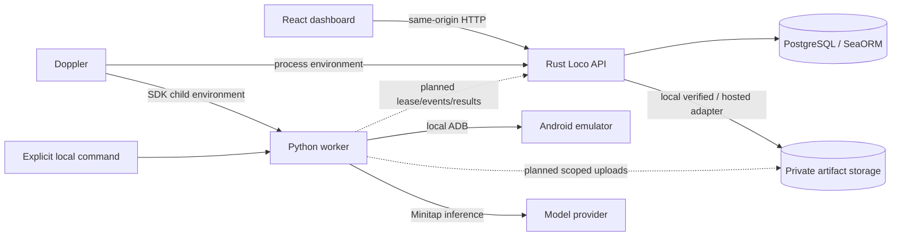

# System architecture

Status: local app setup and Android test runner implemented; one live Minitap demo verified.
Hosted acceptance, full device qualification and UI-to-worker job dispatch remain open.
[Current status](status.md) separates these explicitly.

## Component ownership

| Location               | Responsibility                                                                      | Current state                                                                                         |
| ---------------------- | ----------------------------------------------------------------------------------- | ----------------------------------------------------------------------------------------------------- |
| `apps/api`             | Rust/Loco API, authorization, domain services, scheduling, verification and reports | Auth, apps/environments, private APK intake and build history implemented; scheduling/reports planned |
| `apps/api/migration`   | SeaORM database migrations                                                          | Twelve product tables with tenant/lifecycle constraints; real PostgreSQL tests                        |
| `apps/web`             | React/Vite dashboard using React Router, TanStack Query, Mantine                    | Authenticated Mantine dashboard, App and Settings; Tests/Runs placeholders                            |
| `apps/mobile-worker`   | Python/uv adapter, device observations and evidence                                 | Local ADB demo and live Minitap demo verified; network jobs planned                                   |
| `crates/contracts`     | Pure Rust transport DTOs and browser endpoint declarations                          | Browser setup operations plus worker fixture and qualification contracts; no Loco/DB dependency       |
| `contracts`            | Generated OpenAPI/JSON Schema and serialization fixtures                            | Derived from Rust, committed and checked for drift                                                    |
| `infra`                | Local infrastructure and future device-host provisioning                            | Isolated PostgreSQL and pinned Mac/Linux device-host setup                                            |
| `scripts` / `justfile` | Explicit development, generation and validation                                     | Implemented; no check watchers                                                                        |
| `docs/architect`       | Product/architecture/specification source of truth                                  | This packet                                                                                           |

Root Cargo.toml is a virtual workspace. Keep runnable applications under apps and shared
code outside it. Each language uses its native tooling and locked dependencies. Loco's
internal conventions stay together under apps/api; use backend scaffolding there and a
separately generated browser client. No additional monorepo orchestration framework is
needed for the current package count. [Dependency provenance](dependencies.md) records
versions and upstream adaptations.

## Runtime boundaries

The UI/API app-setup flow, local persistence and artifact validation are implemented.
Hosted S3-compatible storage is configured in code but has no authorized round-trip evidence.
The explicit Python runner controls a local emulator, runs Minitap and independently
verifies the controlled demo before reset. It does not claim API jobs or execute uploaded
customer APKs. Tests/Runs remain main's placeholders; upload validation readiness must
not be presented as execution readiness. Rust will own job admission and outcome aggregation.
Agent completion alone cannot prove
a customer expectation passed. Planned results and immutable manifests follow
[product rules](product.md) and [execution spec](implementation/04-execution-and-reports.md).

Use Railway first for the application, PostgreSQL and private storage, with a separate
qualified Linux emulator host for the pilot. Local Mac runs use Hypervisor.Framework.
See [hosting](hosting.md). In the planned production protocol Python initiates scoped HTTP worker calls;
it does not receive database credentials. Keep one active case per device and exclusive
test-account leases. Add capacity only after measured queue wait, reset reliability and
cost justify it. [Spec 07](implementation/07-pilot-readiness-and-scale.md) owns scaling.

## Artifact storage

Spec 03 uses private local storage in development and Railway Buckets for hosted APKs,
with AWS S3 as the later destination. Keep a local/S3-compatible adapter boundary and
persist internal backend IDs plus object keys, never provider URLs in browser contracts.
Only temporary upload/validation scratch lives on the API application's disk. Migration
requires copying and checksum-verifying objects before switching the configured backend;
existing build IDs/checksums remain stable. The adapter is implemented; hosted infrastructure has not been provisioned or verified. [Spec 03](implementation/03-app-setup-and-ui-backend.md) owns the details.

## Persistence and ORM

Use SeaORM through Loco with PostgreSQL. Add entities/domain services and versioned
migrations as features arrive; do not introduce a parallel hand-maintained SQL access
layer. SQLx is an upstream dependency of the ORM, not a second application data layer.
The ORM reduces mapping and query boilerplate; it does not replace schema evolution,
indexes, transaction design or business invariants. Database records are distinct from
public transport DTOs. [Spec 03](implementation/03-app-setup-and-ui-backend.md) owns the
first product records; [spec 04](implementation/04-execution-and-reports.md) adds durable
jobs and the narrow transactional claim/lease behavior.

## Related decisions

- [Contracts](contracts.md): Rust → generated TypeScript SDK/Zod and worker Pydantic.
- [Environment](environment.md): Doppler runtime injection, no env files, isolated local DB.
- [Development](development.md): complete authoring before strict affected verification.
- [Device feasibility](implementation/02-cloud-phone-and-feasibility.md): qualify one Android
  emulator before committing to real execution; no cloud device is provisioned yet.
- [Product](product.md): Android-first operated pilot; iOS, broad fleets and App Store
  submission are outside the current implementation boundary.

## Execution ownership

Rust owns immutable saved test definitions, manifests, queue attempts, worker
identity, physical-resource reservations, event deduplication and evidence verdicts.
The Python polling supervisor owns execution/cleanup on its host. A database lease
expiry invalidates completion authority while keeping reservations quarantined until
physical recovery; it cannot stop a surviving device process by itself.

The first adapter is the controlled persistence demo. Semantic navigate actions use
Minitap; process restart and evidence checkpoints are explicit supervisor operations.
Rust re-evaluates the supported UI checks from retained hierarchy bytes; SDK completion
is not a pass assertion. React polls the report API and displays required coverage,
missing evidence, cancellation and cleanup independently of worker exit status.
